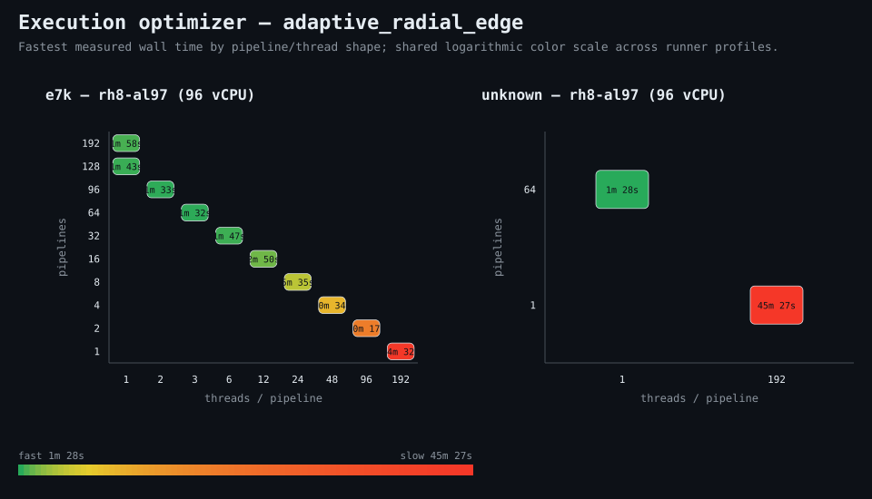

### Execution optimizer summary

Detector: `adaptive_radial_edge`  
Optimizer run: **31401409073** — execution data below contains only shapes completed in this execution; the preferred configuration may use all compatible completed optimizer evidence.

<strong>Navigation</strong>

- [Preferred Detector Run Configuration](#preferred-detector-run-configuration)
- [Detector Run Profile Plot](#detector-run-profile-plot)
- [Detector Pipeline-Thread Shape Optimization Data](#detector-pipeline-thread-shape-optimization-data)

<strong>1. Preferred Detector Run Configuration</strong>

Compatible completed optimizer runs are coalesced by detector, workload, and concrete runner profile. Repeated shapes retain all observations; the preferred shape is selected canonically by throughput, then lower resource use for throughput-equivalent shapes.

| Detector | Runner | CPU | Physical | Logical | RAM | Preferred pipelines | Threads / pipeline | Preferred shape range (≤2%) | Search method | Optimization time | Allocated | Sets/s | Shape time | Observations |
|---|---|---|---:|---:|---:|---:|---:|---|---|---:|---:|---:|---:|---:|
| adaptive_radial_edge | 192t — rh8-al321 (192 vCPU) | AMD EPYC 9655 96-Core Processor | 192 | 192 | 1511.3 GiB | 63 | 6 | 63p/6t | adaptive | 4m 10s | 378 | 145.82 | 45s | 1 |
| adaptive_radial_edge | 192t — rh8-al323 (192 vCPU) | AMD EPYC 9655 96-Core Processor | 192 | 192 | 1511.3 GiB | 60 | 6 | 60p/6t, 64p/6t | adaptive | 33m 4s | 360 | 152.60 | 43s | 1 |
| adaptive_radial_edge | 32t — rh8-s32 (32 vCPU) | AMD EPYC 9175F 16-Core Processor | 16 | 32 | 1511.3 GiB | 22 | 2 | 21p/3t, 22p/2t, 23p/2t, 24p/2t, 25p/2t, 26p/2t, 27p/2t | adaptive | 19m 31s | 44 | 74.57 | 1m 28s | 1 |
| adaptive_radial_edge | e7k — rh8-al97 (96 vCPU) | AMD EPYC 74F3 24-Core Processor | 48 | 96 | 2003.9 GiB | 49 | 3 | 46p/4t, 49p/3t, 50p/3t, 51p/3t, 52p/3t | exhaustive | 3h 35m 57s | 147 | 70.56 | 1m 33s | 1 |

**Search method legend:** `adaptive` = sparse wide-range search with local refinement around the measured peak and ≤2% preferred-shape boundaries; `powers-of-2` = logarithmic power-of-two pipeline sweep; `exhaustive` = every legal pipeline count in the requested range.

[↑ Back to Navigation](#table-of-contents)

<strong>2. Detector Run Profile Plot</strong>

Compatible completed measurements are plotted as detector pipelines versus parameter sets/second; thread count is annotated at each measured shape.
**Search method:** `adaptive`

[↑ Back to Navigation](#table-of-contents)

<strong>3. Detector Pipeline-Thread Shape Optimization Data</strong>

Shapes completed in this execution are shown below.

| Runner | Pipelines | Shards | Threads / pipeline | Allocated | Wall | Sets/s | Speedup | Δ from best | Avg load | Peak load | Avg CPU | Peak RAM |
|---|---:|---:|---:|---:|---:|---:|---:|---:|---:|---:|---:|---:|
| 32t — rh8-s32 (32 vCPU) | 8 | 8 | 8 | 64 | 2m 58s | 36.87 | — | -50.56% | 20.9 | 23.2 | 47.5% | 15.2 GiB |
| 32t — rh8-s32 (32 vCPU) | 16 | 16 | 4 | 64 | 1m 37s | 67.65 | — | -9.28% | 101.3 | 106.9 | 85.5% | 16.1 GiB |
| 32t — rh8-s32 (32 vCPU) | 20 | 20 | 3 | 60 | 1m 30s | 72.91 | — | -2.22% | 112.0 | 119.7 | 88.8% | 16.4 GiB |
| 32t — rh8-s32 (32 vCPU) | 21 | 21 | 3 | 63 | 1m 29s | 73.73 | — | -1.12% | 121.0 | 121.0 | 86.2% | 16.6 GiB |
| **32t — rh8-s32 (32 vCPU)** | 22 | 22 | 2 | 44 | 1m 28s | 74.57 | — | 0.00% | 101.0 | 102.5 | 90.4% | 16.2 GiB |
| 32t — rh8-s32 (32 vCPU) | 23 | 23 | 2 | 46 | 1m 29s | 73.73 | — | -1.12% | 112.5 | 112.5 | 86.9% | 16.3 GiB |
| 32t — rh8-s32 (32 vCPU) | 24 | 24 | 2 | 48 | 1m 29s | 73.73 | — | -1.12% | 121.5 | 121.5 | 86.5% | 16.4 GiB |
| 32t — rh8-s32 (32 vCPU) | 25 | 25 | 2 | 50 | 1m 29s | 73.73 | — | -1.12% | 153.2 | 166.3 | 90.5% | 16.6 GiB |
| 32t — rh8-s32 (32 vCPU) | 26 | 26 | 2 | 52 | 1m 28s | 74.57 | — | 0.00% | 137.2 | 137.2 | 88.8% | 16.8 GiB |
| 32t — rh8-s32 (32 vCPU) | 27 | 27 | 2 | 54 | 1m 29s | 73.73 | — | -1.12% | 136.8 | 138.6 | 89.7% | 16.9 GiB |
| 32t — rh8-s32 (32 vCPU) | 28 | 28 | 2 | 56 | 1m 30s | 72.91 | — | -2.22% | 133.1 | 133.1 | 92.5% | 17.2 GiB |
| 32t — rh8-s32 (32 vCPU) | 32 | 32 | 2 | 64 | 1m 31s | 72.11 | — | -3.30% | 102.1 | 102.1 | 92.9% | 17.7 GiB |

**Early stop:** throughput plateau detected after 3 consecutive completed shapes improved by less than 2.0% from the perceived maximum.

[↑ Back to Navigation](#table-of-contents)
