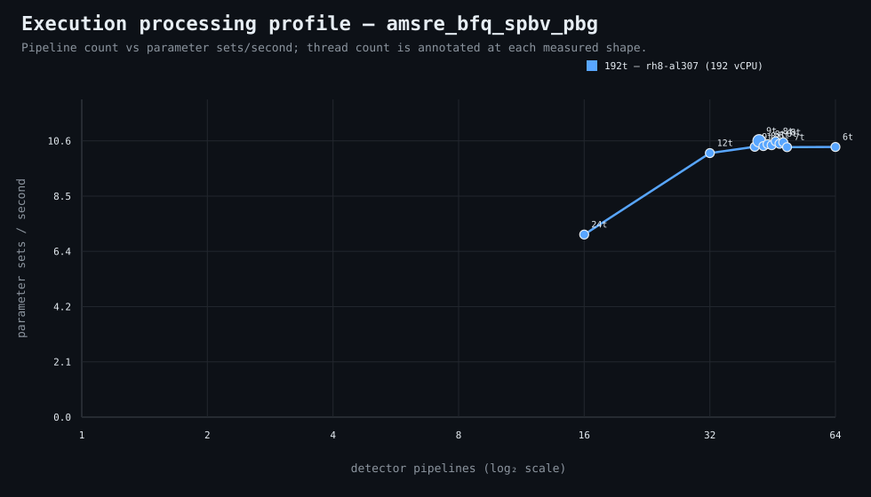

### Execution optimizer summary

Detector: `amsre_bfq_spbv_pbg`  
Optimizer run: **31845426008** — execution data below contains only shapes completed in this execution; the preferred configuration may use all compatible completed optimizer evidence.

<strong>Navigation</strong>

- [Preferred Detector Run Configuration](#preferred-detector-run-configuration)
- [Detector Run Profile Plot](#detector-run-profile-plot)
- [Detector Pipeline-Thread Shape Optimization Data](#detector-pipeline-thread-shape-optimization-data)

<strong>1. Preferred Detector Run Configuration</strong>

Compatible completed optimizer runs are coalesced by detector, workload, and concrete runner profile. Repeated shapes retain all observations; the preferred shape is selected canonically by throughput, then lower resource use for throughput-equivalent shapes.

| Detector | Runner | CPU | Physical | Logical | RAM | Preferred pipelines | Threads / pipeline | Preferred shape range (≤2%) | Search method | Optimization time | Allocated | Sets/s | Shape time | Observations |
|---|---|---|---:|---:|---:|---:|---:|---|---|---:|---:|---:|---:|---:|
| amsre_bfq_spbv_pbg | 192t — rh8-al307 (192 vCPU) | AMD EPYC 9655 96-Core Processor | 192 | 192 | 6047.3 GiB | 42 | 9 | 42p/9t, 43p/8t, 44p/8t, 45p/8t, 46p/8t, 47p/8t, 48p/8t | adaptive | 16h 41m 35s | 378 | 10.60 | 1h 18m 54s | 1 |

**Search method legend:** `adaptive` = sparse wide-range search with local refinement around the measured peak and ≤2% preferred-shape boundaries; `powers-of-2` = logarithmic power-of-two pipeline sweep; `exhaustive` = every legal pipeline count in the requested range.

**Shape-prediction coverage:** vCPU anchors `192`; readiness **low**; prediction checks **0 verified / 0 pending**.
**Desired / missing optimization data:** missing: a second vCPU size to establish shape scaling.

[↑ Back to Navigation](#table-of-contents)

<strong>2. Detector Run Profile Plot</strong>

Compatible completed measurements are plotted as detector pipelines versus parameter sets/second; thread count is annotated at each measured shape.
**Search method:** `adaptive`

[↑ Back to Navigation](#table-of-contents)

<strong>3. Detector Pipeline-Thread Shape Optimization Data</strong>

Shapes completed in this execution are shown below.

This table contains measurements from this optimizer execution only. Bold identifies this run’s measured throughput winner; the preferred configuration above is selected from all compatible coalesced optimizer evidence.

| Runner | Pipelines | Shards | Threads / pipeline | Allocated | Wall | Sets/s | Speedup | Δ from run best | Avg load | Peak load | Avg CPU | Peak RAM |
|---|---:|---:|---:|---:|---:|---:|---:|---:|---:|---:|---:|---:|
| 192t — rh8-al307 (192 vCPU) | 16 | 16 | 24 | 384 | 1h 59m 25s | 7.00 | — | -33.93% | 981.6 | 1144.7 | 94.2% | 57.2 GiB |
| 192t — rh8-al307 (192 vCPU) | 32 | 32 | 12 | 384 | 1h 22m 34s | 10.13 | — | -4.44% | 1559.5 | 1749.3 | 97.2% | 61.3 GiB |
| 192t — rh8-al307 (192 vCPU) | 41 | 41 | 9 | 369 | 1h 20m 38s | 10.37 | — | -2.15% | 1779.3 | 2003.5 | 97.8% | 62.5 GiB |
| **192t — rh8-al307 (192 vCPU)** | 42 | 42 | 9 | 378 | 1h 18m 54s | 10.60 | — | 0.00% | 1868.8 | 2130.2 | 99.1% | 63.8 GiB |
| 192t — rh8-al307 (192 vCPU) | 43 | 43 | 8 | 344 | 1h 20m 26s | 10.40 | — | -1.91% | 1843.4 | 2093.7 | 98.9% | 61.6 GiB |
| 192t — rh8-al307 (192 vCPU) | 44 | 44 | 8 | 352 | 1h 19m 51s | 10.47 | — | -1.19% | 1884.6 | 2074.3 | 98.3% | 62.7 GiB |
| 192t — rh8-al307 (192 vCPU) | 45 | 45 | 8 | 360 | 1h 20m 9s | 10.43 | — | -1.56% | 1913.1 | 2118.3 | 99.2% | 62.9 GiB |
| 192t — rh8-al307 (192 vCPU) | 46 | 46 | 8 | 368 | 1h 19m 1s | 10.58 | — | -0.15% | 1934.3 | 2120.7 | 98.3% | 63.9 GiB |
| 192t — rh8-al307 (192 vCPU) | 47 | 47 | 8 | 376 | 1h 19m 45s | 10.49 | — | -1.07% | 1974.7 | 2219.9 | 98.8% | 64.6 GiB |
| 192t — rh8-al307 (192 vCPU) | 48 | 48 | 8 | 384 | 1h 19m 18s | 10.55 | — | -0.50% | 2029.5 | 2312.6 | 99.4% | 65.5 GiB |
| 192t — rh8-al307 (192 vCPU) | 49 | 49 | 7 | 343 | 1h 20m 44s | 10.36 | — | -2.27% | 1979.5 | 2354.0 | 98.2% | 63.3 GiB |
| 192t — rh8-al307 (192 vCPU) | 64 | 64 | 6 | 384 | 1h 20m 42s | 10.36 | — | -2.23% | 2528.4 | 2798.2 | 98.9% | 69.9 GiB |

**Early stop:** throughput plateau detected after 3 consecutive completed shapes improved by less than 2.0% from the perceived maximum.

[↑ Back to Navigation](#table-of-contents)
