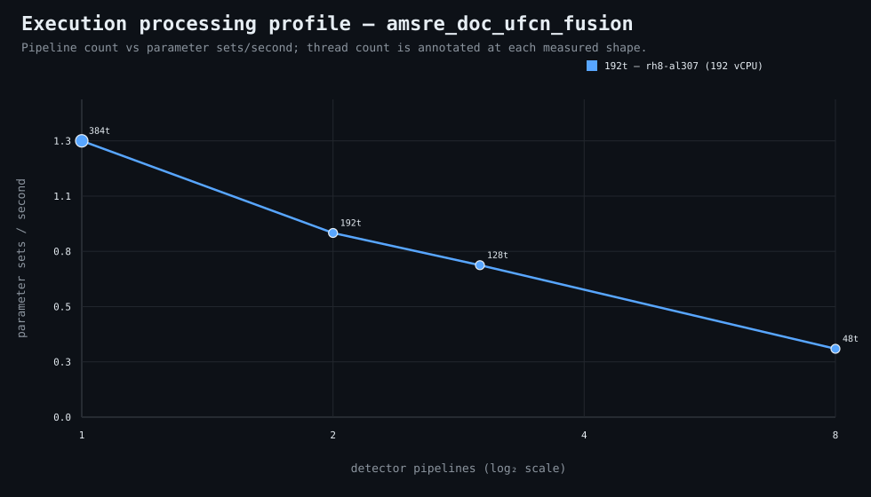

### Execution optimizer summary

Detector: `amsre_doc_ufcn_fusion`  
Optimizer run: **32875746824** — execution data below contains only shapes completed in this execution; the preferred configuration may use all compatible completed optimizer evidence.

<strong>Navigation</strong>

- [Preferred Detector Run Configuration](#preferred-detector-run-configuration)
- [Detector Run Profile Plot](#detector-run-profile-plot)
- [Detector Pipeline-Thread Shape Optimization Data](#detector-pipeline-thread-shape-optimization-data)

<strong>1. Preferred Detector Run Configuration</strong>

Compatible completed optimizer runs are coalesced by detector, workload, and concrete runner profile. Repeated shapes retain all observations; the preferred shape is selected canonically by throughput, then lower resource use for throughput-equivalent shapes.

| Detector | Runner | CPU | Physical | Logical | RAM | Preferred pipelines | Threads / pipeline | Preferred shape range (≤2%) | Search method | Optimization time | Allocated | Sets/s | Shape time | Observations |
|---|---|---|---:|---:|---:|---:|---:|---|---|---:|---:|---:|---:|---:|
| amsre_doc_ufcn_fusion | 192t — rh8-al320 (192 vCPU) | AMD EPYC 9655 96-Core Processor | 192 | 192 | 503.3 GiB | 2 | 192 | 2p/192t | legacy | 5m 4s | 384 | 0.97 | 30s | 4 |

**Search method legend:** `adaptive` = sparse wide-range search with local refinement around the measured peak and ≤2% preferred-shape boundaries; `powers-of-2` = logarithmic power-of-two pipeline sweep; `exhaustive` = every legal pipeline count in the requested range.

**Shape-prediction coverage:** vCPU anchors `192`; readiness **low**; prediction checks **0 verified / 0 pending**.
**Desired / missing optimization data:** missing: a second vCPU size to establish shape scaling.

[↑ Back to Navigation](#table-of-contents)

<strong>2. Detector Run Profile Plot</strong>

Compatible completed measurements are plotted as detector pipelines versus parameter sets/second; thread count is annotated at each measured shape.
**Search method:** `adaptive`

[↑ Back to Navigation](#table-of-contents)

<strong>3. Detector Pipeline-Thread Shape Optimization Data</strong>

Shapes completed in this execution are shown below.

This table contains measurements from this optimizer execution only. Bold identifies this run’s measured throughput winner; the preferred configuration above is selected from all compatible coalesced optimizer evidence.

| Runner | Pipelines | Shards | Threads / pipeline | Allocated | Wall | Startup overhead | Sets/s | Speedup | Δ from run best | Avg load | Peak load | Avg CPU | Peak RAM |
|---|---:|---:|---:|---:|---:|---:|---:|---:|---:|---:|---:|---:|---:|
| **192t — rh8-al320 (192 vCPU)** | 2 | 2 | 192 | 384 | 30s | 0s | 0.97 | — | 0.00% | — | — | — | — |
| 192t — rh8-al320 (192 vCPU) | 3 | 3 | 128 | 384 | 39s | 0s | 0.74 | — | -23.08% | 414.1 | 414.1 | 92.4% | 8.7 GiB |
| 192t — rh8-al320 (192 vCPU) | 6 | 6 | 64 | 384 | 1m 7s | 0s | 0.43 | — | -55.22% | 500.6 | 500.6 | 93.4% | 10.5 GiB |
| 192t — rh8-al320 (192 vCPU) | 16 | 16 | 24 | 384 | 2m 48s | 0s | 0.17 | — | -82.14% | 361.9 | 488.8 | 90.9% | 15.5 GiB |

**Startup-overhead note:** executor startup is measured from `run-detector-regressions` entry through detector lifecycle preparation, planning, shared learned-evidence resolution/preparation, and initial queue setup before pipeline fan-out. It remains included in **Wall** and therefore in shape-level **Sets/s** as a constant reminder of incurred end-to-end cost. Per-shard parameter-set throughput is timed after fan-out and does not include this pre-fan-out startup overhead.

**Early stop:** throughput plateau detected after 3 consecutive completed shapes improved by less than 2.0% from the perceived maximum.

[↑ Back to Navigation](#table-of-contents)
