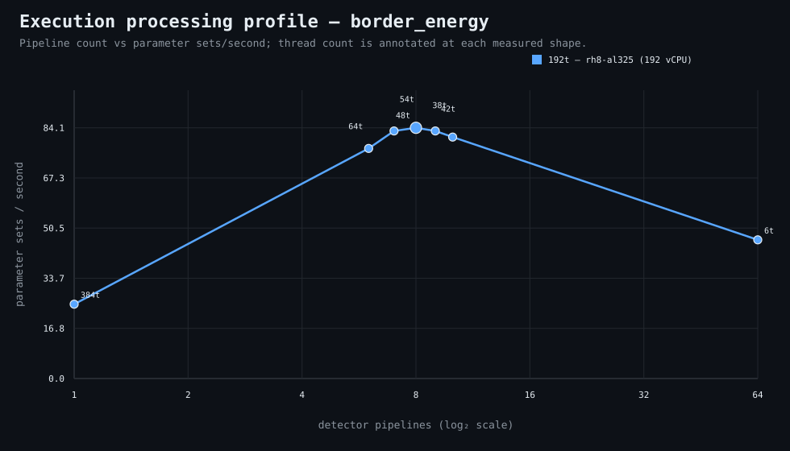

### Execution optimizer summary

Detector: `border_energy`  
Optimizer run: **31337244867** — execution data below contains only shapes completed in this execution; the preferred configuration may use all compatible completed optimizer evidence.

<strong>Navigation</strong>

- [Preferred Detector Run Configuration](#preferred-detector-run-configuration)
- [Detector Run Profile Plot](#detector-run-profile-plot)
- [Detector Pipeline-Thread Shape Optimization Data](#detector-pipeline-thread-shape-optimization-data)

<strong>1. Preferred Detector Run Configuration</strong>

Compatible completed optimizer runs are coalesced by detector, workload, and concrete runner profile. Repeated shapes retain all observations; the preferred shape is selected canonically by throughput, then lower resource use for throughput-equivalent shapes.

| Detector | Runner | CPU | Physical | Logical | RAM | Preferred pipelines | Threads / pipeline | Preferred shape range (≤2%) | Search method | Optimization time | Allocated | Sets/s | Shape time | Observations |
|---|---|---|---:|---:|---:|---:|---:|---|---|---:|---:|---:|---:|---:|
| border_energy | 192t — rh8-al325 (192 vCPU) | AMD EPYC 9655 96-Core Processor | 192 | 192 | 1511.3 GiB | 8 | 48 | 7p/54t, 8p/48t, 9p/42t | adaptive | 13m 27s | 384 | 84.13 | 1m 18s | 1 |

[↑ Back to Navigation](#table-of-contents)

<strong>2. Detector Run Profile Plot</strong>

Compatible completed measurements are plotted as detector pipelines versus parameter sets/second; thread count is annotated at each measured shape.
**Search method:** `adaptive`

[↑ Back to Navigation](#table-of-contents)

<strong>3. Detector Pipeline-Thread Shape Optimization Data</strong>

Shapes completed in this execution are shown below.

| Runner | Pipelines | Shards | Threads / pipeline | Allocated | Wall | Sets/s | Speedup | Δ from best | Avg load | Peak load | Avg CPU | Peak RAM |
|---|---:|---:|---:|---:|---:|---:|---:|---:|---:|---:|---:|---:|
| 192t — rh8-al325 (192 vCPU) | 1 | 1 | 384 | 384 | 4m 23s | 24.95 | 1.00× | -70.34% | 52.4 | 56.7 | 38.2% | 22.9 GiB |
| 192t — rh8-al325 (192 vCPU) | 6 | 6 | 64 | 384 | 1m 25s | 77.20 | 3.09× | -8.24% | 863.6 | 875.2 | 94.0% | 23.5 GiB |
| 192t — rh8-al325 (192 vCPU) | 7 | 7 | 54 | 378 | 1m 19s | 83.06 | 3.33× | -1.27% | 1087.8 | 1087.8 | 92.4% | 23.4 GiB |
| **192t — rh8-al325 (192 vCPU)** | 8 | 8 | 48 | 384 | 1m 18s | 84.13 | 3.37× | 0.00% | 1816.5 | 2193.8 | 92.8% | 23.8 GiB |
| 192t — rh8-al325 (192 vCPU) | 9 | 9 | 42 | 378 | 1m 19s | 83.06 | 3.33× | -1.27% | 975.8 | 975.8 | 92.6% | 23.8 GiB |
| 192t — rh8-al325 (192 vCPU) | 10 | 10 | 38 | 380 | 1m 21s | 81.01 | 3.25× | -3.70% | 963.7 | 963.7 | 92.0% | 24.0 GiB |
| 192t — rh8-al325 (192 vCPU) | 64 | 64 | 6 | 384 | 2m 21s | 46.54 | 1.87× | -44.68% | 1903.7 | 2504.5 | 84.3% | 32.9 GiB |

**Early stop:** throughput plateau detected after 3 consecutive completed shapes improved by less than 2.0% from the perceived maximum.

[↑ Back to Navigation](#table-of-contents)
