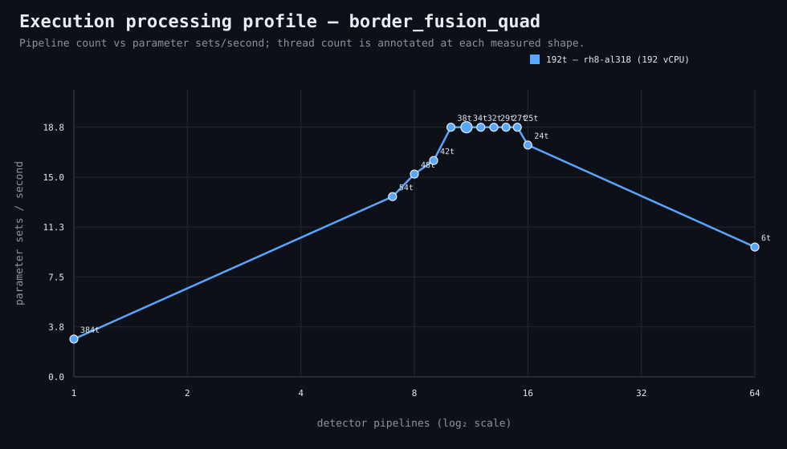

### Execution optimizer summary

Detector: `border_fusion_quad`  
Optimizer run: **31714573640** — execution data below contains only shapes completed in this execution; the preferred configuration may use all compatible completed optimizer evidence.

<strong>Navigation</strong>

- [Preferred Detector Run Configuration](#preferred-detector-run-configuration)
- [Detector Run Profile Plot](#detector-run-profile-plot)
- [Detector Pipeline-Thread Shape Optimization Data](#detector-pipeline-thread-shape-optimization-data)

<strong>1. Preferred Detector Run Configuration</strong>

Compatible completed optimizer runs are coalesced by detector, workload, and concrete runner profile. Repeated shapes retain all observations; the preferred shape is selected canonically by throughput, then lower resource use for throughput-equivalent shapes.

| Detector | Runner | CPU | Physical | Logical | RAM | Preferred pipelines | Threads / pipeline | Preferred shape range (≤2%) | Search method | Optimization time | Allocated | Sets/s | Shape time | Observations |
|---|---|---|---:|---:|---:|---:|---:|---|---|---:|---:|---:|---:|---:|
| border_fusion_quad | 192t — rh8-al318 (192 vCPU) | AMD EPYC 9655 96-Core Processor | 192 | 192 | 1511.3 GiB | 11 | 34 | 10p/38t, 11p/34t, 12p/32t, 13p/29t, 14p/27t, 15p/25t | adaptive | 4m 18s | 374 | 18.77 | 13s | 1 |

**Search method legend:** `adaptive` = sparse wide-range search with local refinement around the measured peak and ≤2% preferred-shape boundaries; `powers-of-2` = logarithmic power-of-two pipeline sweep; `exhaustive` = every legal pipeline count in the requested range.

**Shape-prediction coverage:** vCPU anchors `192`; readiness **low**; prediction checks **0 verified / 0 pending**.
**Desired / missing optimization data:** missing: a second vCPU size to establish shape scaling.

[↑ Back to Navigation](#table-of-contents)

<strong>2. Detector Run Profile Plot</strong>

Compatible completed measurements are plotted as detector pipelines versus parameter sets/second; thread count is annotated at each measured shape.
**Search method:** `adaptive`

[↑ Back to Navigation](#table-of-contents)

<strong>3. Detector Pipeline-Thread Shape Optimization Data</strong>

Shapes completed in this execution are shown below.

| Runner | Pipelines | Shards | Threads / pipeline | Allocated | Wall | Sets/s | Speedup | Δ from best | Avg load | Peak load | Avg CPU | Peak RAM |
|---|---:|---:|---:|---:|---:|---:|---:|---:|---:|---:|---:|---:|
| 192t — rh8-al318 (192 vCPU) | 1 | 1 | 384 | 384 | 1m 26s | 2.84 | 1.00× | -84.88% | 36.0 | 36.0 | 1.2% | 21.3 GiB |
| 192t — rh8-al318 (192 vCPU) | 7 | 7 | 54 | 378 | 18s | 13.56 | 4.78× | -27.78% | — | — | — | — |
| 192t — rh8-al318 (192 vCPU) | 8 | 8 | 48 | 384 | 16s | 15.25 | 5.38× | -18.75% | 179.2 | 179.2 | 8.6% | 22.1 GiB |
| 192t — rh8-al318 (192 vCPU) | 9 | 9 | 42 | 378 | 15s | 16.27 | 5.73× | -13.33% | — | — | — | — |
| 192t — rh8-al318 (192 vCPU) | 10 | 10 | 38 | 380 | 13s | 18.77 | 6.62× | 0.00% | 106.8 | 106.8 | 10.0% | 11.0 GiB |
| **192t — rh8-al318 (192 vCPU)** | 11 | 11 | 34 | 374 | 13s | 18.77 | 6.62× | 0.00% | — | — | — | — |
| 192t — rh8-al318 (192 vCPU) | 12 | 12 | 32 | 384 | 13s | 18.77 | 6.62× | 0.00% | — | — | — | — |
| 192t — rh8-al318 (192 vCPU) | 13 | 13 | 29 | 377 | 13s | 18.77 | 6.62× | 0.00% | — | — | — | — |
| 192t — rh8-al318 (192 vCPU) | 14 | 14 | 27 | 378 | 13s | 18.77 | 6.62× | 0.00% | — | — | — | — |
| 192t — rh8-al318 (192 vCPU) | 15 | 15 | 25 | 375 | 13s | 18.77 | 6.62× | 0.00% | 53.1 | 53.1 | 14.0% | 22.7 GiB |
| 192t — rh8-al318 (192 vCPU) | 16 | 16 | 24 | 384 | 14s | 17.43 | 6.14× | -7.14% | — | — | — | — |
| 192t — rh8-al318 (192 vCPU) | 64 | 64 | 6 | 384 | 25s | 9.76 | 3.44× | -48.00% | — | — | — | — |

**Early stop:** throughput plateau detected after 3 consecutive completed shapes improved by less than 2.0% from the perceived maximum.

[↑ Back to Navigation](#table-of-contents)
