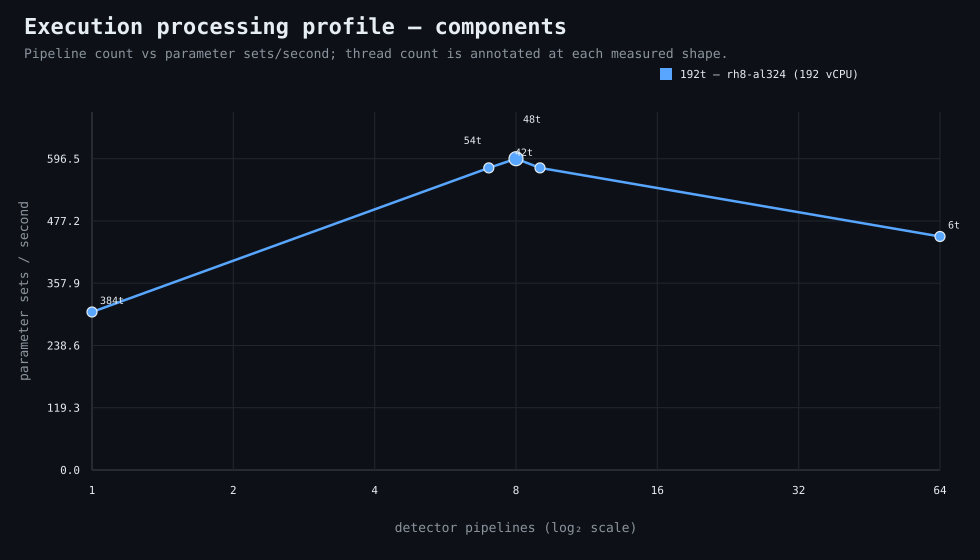

### Execution optimizer summary

Detector: `components`  
Optimizer run: **31337318885** — execution data below contains only shapes completed in this execution; the preferred configuration may use all compatible completed optimizer evidence.

<strong>Navigation</strong>

- [Preferred Detector Run Configuration](#preferred-detector-run-configuration)
- [Detector Run Profile Plot](#detector-run-profile-plot)
- [Detector Pipeline-Thread Shape Optimization Data](#detector-pipeline-thread-shape-optimization-data)

<strong>1. Preferred Detector Run Configuration</strong>

Compatible completed optimizer runs are coalesced by detector, workload, and concrete runner profile. Repeated shapes retain all observations; the preferred shape is selected canonically by throughput, then lower resource use for throughput-equivalent shapes.

| Detector | Runner | CPU | Physical | Logical | RAM | Preferred pipelines | Threads / pipeline | Preferred shape range (≤2%) | Search method | Optimization time | Allocated | Sets/s | Shape time | Observations |
|---|---|---|---:|---:|---:|---:|---:|---|---|---:|---:|---:|---:|---:|
| components | 192t — rh8-al324 (192 vCPU) | AMD EPYC 9655 96-Core Processor | 192 | 192 | 1511.3 GiB | 8 | 48 | 8p/48t | adaptive | 3m 31s | 384 | 596.45 | 33s | 1 |

[↑ Back to Navigation](#table-of-contents)

<strong>2. Detector Run Profile Plot</strong>

Compatible completed measurements are plotted as detector pipelines versus parameter sets/second; thread count is annotated at each measured shape.
**Search method:** `adaptive`

[↑ Back to Navigation](#table-of-contents)

<strong>3. Detector Pipeline-Thread Shape Optimization Data</strong>

Shapes completed in this execution are shown below.

| Runner | Pipelines | Shards | Threads / pipeline | Allocated | Wall | Sets/s | Speedup | Δ from best | Avg load | Peak load | Avg CPU | Peak RAM |
|---|---:|---:|---:|---:|---:|---:|---:|---:|---:|---:|---:|---:|
| 192t — rh8-al324 (192 vCPU) | 1 | 1 | 384 | 384 | 1m 5s | 302.82 | 1.00× | -49.23% | 29.3 | 29.3 | 24.9% | 15.6 GiB |
| 192t — rh8-al324 (192 vCPU) | 7 | 7 | 54 | 378 | 34s | 578.91 | 1.91× | -2.94% | 845.0 | 845.0 | 76.0% | 11.0 GiB |
| **192t — rh8-al324 (192 vCPU)** | 8 | 8 | 48 | 384 | 33s | 596.45 | 1.97× | 0.00% | 766.1 | 766.1 | 61.9% | 16.1 GiB |
| 192t — rh8-al324 (192 vCPU) | 9 | 9 | 42 | 378 | 34s | 578.91 | 1.91× | -2.94% | — | — | — | — |
| 192t — rh8-al324 (192 vCPU) | 64 | 64 | 6 | 384 | 44s | 447.34 | 1.48× | -25.00% | — | — | — | — |

**Stop reason:** `adaptive_search_complete`

[↑ Back to Navigation](#table-of-contents)
