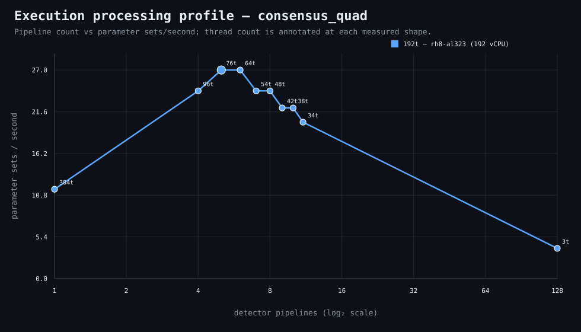

### Execution optimizer summary

Detector: `consensus_quad`  
Optimizer run: **31333206986** — execution data below contains only shapes completed in this execution; the preferred configuration may use all compatible completed optimizer evidence.

<strong>Navigation</strong>

- [Preferred Detector Run Configuration](#preferred-detector-run-configuration)
- [Detector Run Profile Plot](#detector-run-profile-plot)
- [Detector Pipeline-Thread Shape Optimization Data](#detector-pipeline-thread-shape-optimization-data)

<strong>1. Preferred Detector Run Configuration</strong>

Compatible completed optimizer runs are coalesced by detector, workload, and concrete runner profile. Repeated shapes retain all observations; the preferred shape is the fastest measured compatible shape.

| Detector | Runner | CPU | Physical | Logical | RAM | Preferred pipelines | Threads / pipeline | Preferred shape range (≤2%) | Search method | Optimization time | Allocated | Sets/s | Shape time | Observations |
|---|---|---|---:|---:|---:|---:|---:|---|---|---:|---:|---:|---:|---:|
| consensus_quad | 192t — rh8-al323 (192 vCPU) | AMD EPYC 9655 96-Core Processor | 192 | 192 | 1511.3 GiB | 5 | 76 | 5p/76t, 6p/64t | adaptive | 2m 46s | 380 | 27.00 | 9s | 1 |

[↑ Back to Navigation](#table-of-contents)

<strong>2. Detector Run Profile Plot</strong>

Compatible completed measurements are plotted as detector pipelines versus parameter sets/second; thread count is annotated at each measured shape.
**Search method:** `adaptive`

[↑ Back to Navigation](#table-of-contents)

<strong>3. Detector Pipeline-Thread Shape Optimization Data</strong>

Shapes completed in this execution are shown below.

| Runner | Pipelines | Shards | Threads / pipeline | Allocated | Wall | Sets/s | Speedup | Δ from best | Avg load | Peak load | Avg CPU | Peak RAM |
|---|---:|---:|---:|---:|---:|---:|---:|---:|---:|---:|---:|---:|
| 192t — rh8-al323 (192 vCPU) | 1 | 1 | 384 | 384 | 21s | 11.57 | 1.00× | -57.14% | — | — | — | — |
| 192t — rh8-al323 (192 vCPU) | 4 | 4 | 96 | 384 | 10s | 24.30 | 2.10× | -10.00% | — | — | — | — |
| 192t — rh8-al323 (192 vCPU) | 5 | 5 | 76 | 380 | 9s | 27.00 | 2.33× | 0.00% | — | — | — | — |
| **192t — rh8-al323 (192 vCPU)** | 6 | 6 | 64 | 384 | 9s | 27.00 | 2.33× | 0.00% | — | — | — | — |
| 192t — rh8-al323 (192 vCPU) | 7 | 7 | 54 | 378 | 10s | 24.30 | 2.10× | -10.00% | — | — | — | — |
| 192t — rh8-al323 (192 vCPU) | 8 | 8 | 48 | 384 | 10s | 24.30 | 2.10× | -10.00% | — | — | — | — |
| 192t — rh8-al323 (192 vCPU) | 9 | 9 | 42 | 378 | 11s | 22.09 | 1.91× | -18.18% | 991.7 | 991.7 | 82.6% | 11.7 GiB |
| 192t — rh8-al323 (192 vCPU) | 10 | 10 | 38 | 380 | 11s | 22.09 | 1.91× | -18.18% | — | — | — | — |
| 192t — rh8-al323 (192 vCPU) | 11 | 11 | 34 | 374 | 12s | 20.25 | 1.75× | -25.00% | — | — | — | — |
| 192t — rh8-al323 (192 vCPU) | 128 | 128 | 3 | 384 | 1m 2s | 3.92 | 0.34× | -85.48% | 1212.0 | 1212.0 | 61.8% | 14.8 GiB |

**Stop reason:** `adaptive_search_complete`

[↑ Back to Navigation](#table-of-contents)
