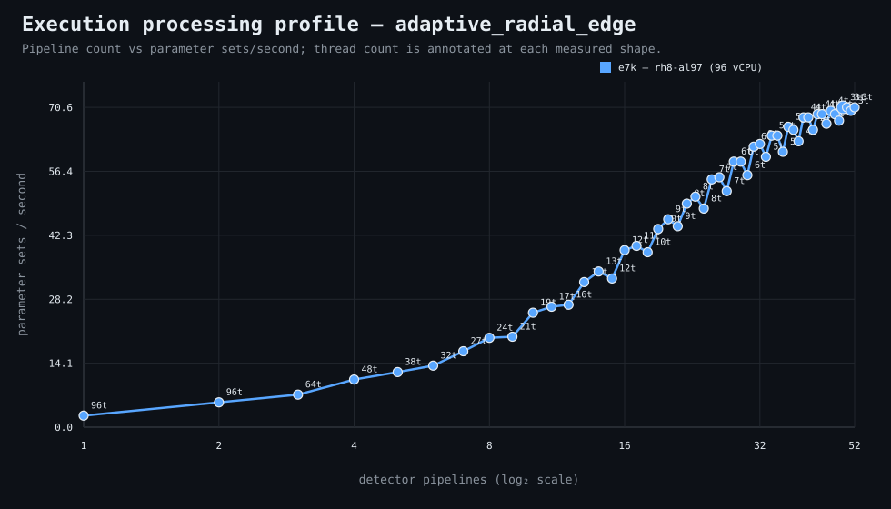
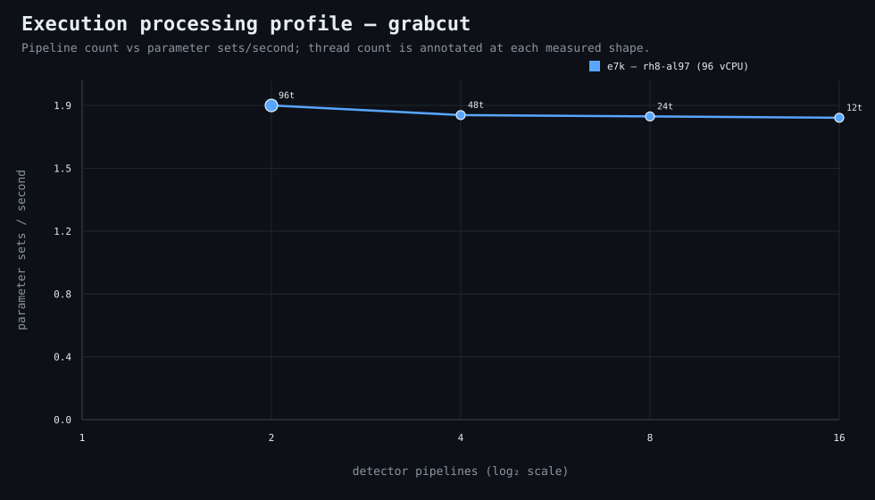

### Execution optimizer summary

> **Note:** This is currently all available optimization data.

Detector: `all`  
This report coalesces compatible measurements from completed optimizer runs only.

<strong>Navigation</strong>

- [Preferred Detector Run Configuration](#preferred-detector-run-configuration)
- [Detector Run Profile Plot](#detector-run-profile-plot)
  - [adaptive_radial_edge](#detector-run-profile-adaptive-radial-edge)
  - [grabcut](#detector-run-profile-grabcut)
- [Detector Pipeline-Thread Shape Optimization Data](#detector-pipeline-thread-shape-optimization-data)
  - [adaptive_radial_edge](#detector-shape-data-adaptive-radial-edge)
  - [grabcut](#detector-shape-data-grabcut)

<strong>1. Preferred Detector Run Configuration</strong>

Compatible completed optimizer runs are coalesced by detector, workload, and concrete runner profile. Repeated shapes retain all observations; the preferred shape is the fastest measured compatible shape.

| Detector | Runner | CPU | Physical | Logical | RAM | Preferred pipelines | Threads / pipeline | Preferred shape range (≤2%) | Allocated | Sets/s | Wall | Observations |
|---|---|---|---:|---:|---:|---:|---:|---|---:|---:|---:|---:|
| adaptive_radial_edge | e7k — rh8-al97 (96 vCPU) | AMD EPYC 74F3 24-Core Processor | 48 | 96 | 2003.9 GiB | 49 | 3 | 46p/4t, 49p/3t, 50p/3t, 51p/3t, 52p/3t | 147 | 70.56 | 1m 33s | 1 |
| grabcut | e7k — rh8-al97 (96 vCPU) | AMD EPYC 74F3 24-Core Processor | 48 | 96 | 2003.9 GiB | 2 | 96 | 2p/96t | 192 | 1.92 | 1h 53m 40s | 1 |

[↑ Back to Navigation](#table-of-contents)

<strong>2. Detector Run Profile Plot</strong>

Compatible completed measurements are plotted by detector; thread count is annotated at each measured shape.

<strong>adaptive_radial_edge</strong>

<strong>grabcut</strong>

[↑ Back to Navigation](#table-of-contents)

<strong>3. Detector Pipeline-Thread Shape Optimization Data</strong>

Coalesced compatible shape measurements from completed optimizer runs are shown below.

<strong>adaptive_radial_edge</strong>

| Runner | Pipelines | Shards | Threads / pipeline | Allocated | Wall | Sets/s | Speedup | Avg load | Peak load | Avg CPU | Peak RAM |
|---|---:|---:|---:|---:|---:|---:|---:|---:|---:|---:|---:|
| e7k — rh8-al97 (96 vCPU) | 1 | 1 | 96 | 96 | 42m 52s | 2.55 | 1.00× | 2.0 | 5.1 | 2.1% | 18.5 GiB |
| e7k — rh8-al97 (96 vCPU) | 2 | 2 | 96 | 192 | 20m | 5.47 | 2.14× | 3.9 | 8.7 | 4.1% | 19.3 GiB |
| e7k — rh8-al97 (96 vCPU) | 3 | 3 | 64 | 192 | 15m 15s | 7.17 | 2.81× | 5.3 | 8.3 | 5.5% | 19.4 GiB |
| e7k — rh8-al97 (96 vCPU) | 4 | 4 | 48 | 192 | 10m 24s | 10.52 | 4.12× | 8.4 | 12.4 | 7.9% | 19.5 GiB |
| e7k — rh8-al97 (96 vCPU) | 5 | 5 | 38 | 190 | 9m | 12.15 | 4.76× | 8.8 | 13.5 | 9.3% | 19.5 GiB |
| e7k — rh8-al97 (96 vCPU) | 6 | 6 | 32 | 192 | 8m 3s | 13.59 | 5.33× | 8.6 | 10.2 | 10.1% | 19.7 GiB |
| e7k — rh8-al97 (96 vCPU) | 7 | 7 | 27 | 189 | 6m 32s | 16.74 | 6.56× | 12.4 | 14.1 | 11.7% | 19.8 GiB |
| e7k — rh8-al97 (96 vCPU) | 8 | 8 | 24 | 192 | 5m 33s | 19.71 | 7.72× | 13.6 | 16.3 | 15.0% | 20.0 GiB |
| e7k — rh8-al97 (96 vCPU) | 9 | 9 | 21 | 189 | 5m 29s | 19.95 | 7.82× | 12.9 | 15.2 | 14.0% | 19.9 GiB |
| e7k — rh8-al97 (96 vCPU) | 10 | 10 | 19 | 190 | 4m 20s | 25.24 | 9.89× | 25.7 | 35.1 | 18.2% | 20.1 GiB |
| e7k — rh8-al97 (96 vCPU) | 11 | 11 | 17 | 187 | 4m 7s | 26.57 | 10.41× | 20.9 | 23.0 | 19.6% | 20.2 GiB |
| e7k — rh8-al97 (96 vCPU) | 12 | 12 | 16 | 192 | 4m 3s | 27.00 | 10.58× | 20.0 | 22.8 | 20.1% | 20.4 GiB |
| e7k — rh8-al97 (96 vCPU) | 13 | 13 | 14 | 182 | 3m 25s | 32.01 | 12.55× | 21.0 | 24.2 | 20.6% | 20.2 GiB |
| e7k — rh8-al97 (96 vCPU) | 14 | 14 | 13 | 182 | 3m 11s | 34.36 | 13.47× | 28.3 | 29.9 | 25.5% | 20.4 GiB |
| e7k — rh8-al97 (96 vCPU) | 15 | 15 | 12 | 180 | 3m 20s | 32.81 | 12.86× | 34.8 | 42.0 | 25.6% | 20.4 GiB |
| e7k — rh8-al97 (96 vCPU) | 16 | 16 | 12 | 192 | 2m 48s | 39.06 | 15.31× | 25.9 | 28.7 | 25.6% | 20.9 GiB |
| e7k — rh8-al97 (96 vCPU) | 17 | 17 | 11 | 187 | 2m 44s | 40.01 | 15.68× | 28.0 | 32.1 | 28.9% | 20.8 GiB |
| e7k — rh8-al97 (96 vCPU) | 18 | 18 | 10 | 180 | 2m 50s | 38.60 | 15.13× | 48.5 | 57.0 | 31.7% | 20.8 GiB |
| e7k — rh8-al97 (96 vCPU) | 19 | 19 | 10 | 190 | 2m 30s | 43.75 | 17.15× | 60.8 | 89.0 | 30.0% | 21.2 GiB |
| e7k — rh8-al97 (96 vCPU) | 20 | 20 | 9 | 180 | 2m 23s | 45.89 | 17.99× | 44.8 | 49.4 | 33.0% | 21.0 GiB |
| e7k — rh8-al97 (96 vCPU) | 21 | 21 | 9 | 189 | 2m 28s | 44.34 | 17.38× | 36.4 | 38.9 | 34.8% | 21.3 GiB |
| e7k — rh8-al97 (96 vCPU) | 22 | 22 | 8 | 176 | 2m 13s | 49.34 | 19.34× | 37.9 | 43.0 | 36.2% | 21.2 GiB |
| e7k — rh8-al97 (96 vCPU) | 23 | 23 | 8 | 184 | 2m 9s | 50.87 | 19.94× | 42.7 | 45.4 | 39.0% | 21.6 GiB |
| e7k — rh8-al97 (96 vCPU) | 24 | 24 | 8 | 192 | 2m 16s | 48.25 | 18.91× | 49.2 | 56.3 | 40.7% | 21.8 GiB |
| e7k — rh8-al97 (96 vCPU) | 25 | 25 | 7 | 175 | 2m | 54.68 | 21.43× | 40.7 | 43.1 | 37.9% | 21.4 GiB |
| e7k — rh8-al97 (96 vCPU) | 26 | 26 | 7 | 182 | 1m 59s | 55.14 | 21.61× | 70.9 | 82.9 | 43.8% | 21.7 GiB |
| e7k — rh8-al97 (96 vCPU) | 27 | 27 | 7 | 189 | 2m 6s | 52.08 | 20.41× | 87.1 | 102.5 | 45.1% | 22.1 GiB |
| e7k — rh8-al97 (96 vCPU) | 28 | 28 | 6 | 168 | 1m 52s | 58.59 | 22.96× | 47.9 | 51.9 | 42.4% | 21.6 GiB |
| e7k — rh8-al97 (96 vCPU) | 29 | 29 | 6 | 174 | 1m 52s | 58.59 | 22.96× | 53.4 | 55.3 | 49.2% | 21.9 GiB |
| e7k — rh8-al97 (96 vCPU) | 30 | 30 | 6 | 180 | 1m 58s | 55.61 | 21.80× | 62.6 | 69.2 | 51.0% | 22.2 GiB |
| e7k — rh8-al97 (96 vCPU) | 31 | 31 | 6 | 186 | 1m 46s | 61.91 | 24.26× | 55.0 | 59.4 | 48.0% | 22.6 GiB |
| e7k — rh8-al97 (96 vCPU) | 32 | 32 | 6 | 192 | 1m 45s | 62.50 | 24.50× | 95.0 | 100.6 | 54.9% | 22.9 GiB |
| e7k — rh8-al97 (96 vCPU) | 33 | 33 | 5 | 165 | 1m 50s | 59.65 | 23.38× | 90.2 | 104.6 | 51.0% | 22.1 GiB |
| e7k — rh8-al97 (96 vCPU) | 34 | 34 | 5 | 170 | 1m 42s | 64.33 | 25.22× | 84.5 | 84.5 | 56.3% | 22.3 GiB |
| e7k — rh8-al97 (96 vCPU) | 35 | 35 | 5 | 175 | 1m 42s | 64.33 | 25.22× | 128.1 | 133.0 | 59.1% | 22.8 GiB |
| e7k — rh8-al97 (96 vCPU) | 36 | 36 | 5 | 180 | 1m 48s | 60.76 | 23.81× | 99.0 | 102.5 | 59.9% | 22.8 GiB |
| e7k — rh8-al97 (96 vCPU) | 37 | 37 | 5 | 185 | 1m 39s | 66.28 | 25.98× | 135.0 | 135.0 | 49.8% | 23.1 GiB |
| e7k — rh8-al97 (96 vCPU) | 38 | 38 | 5 | 190 | 1m 40s | 65.62 | 25.72× | 141.2 | 163.2 | 64.2% | 23.5 GiB |
| e7k — rh8-al97 (96 vCPU) | 39 | 39 | 4 | 156 | 1m 44s | 63.10 | 24.73× | 131.5 | 144.6 | 66.5% | 22.4 GiB |
| e7k — rh8-al97 (96 vCPU) | 40 | 40 | 4 | 160 | 1m 36s | 68.35 | 26.79× | 109.4 | 109.4 | 53.8% | 22.8 GiB |
| e7k — rh8-al97 (96 vCPU) | 41 | 41 | 4 | 164 | 1m 36s | 68.35 | 26.79× | 168.1 | 178.8 | 69.3% | 23.1 GiB |
| e7k — rh8-al97 (96 vCPU) | 42 | 42 | 4 | 168 | 1m 40s | 65.62 | 25.72× | 221.3 | 232.5 | 70.6% | 23.2 GiB |
| e7k — rh8-al97 (96 vCPU) | 43 | 43 | 4 | 172 | 1m 35s | 69.07 | 27.07× | 215.3 | 215.3 | 62.2% | 23.5 GiB |
| e7k — rh8-al97 (96 vCPU) | 44 | 44 | 4 | 176 | 1m 35s | 69.07 | 27.07× | 176.1 | 185.0 | 74.7% | 23.8 GiB |
| e7k — rh8-al97 (96 vCPU) | 45 | 45 | 4 | 180 | 1m 38s | 66.96 | 26.24× | 127.5 | 127.5 | 70.1% | 23.9 GiB |
| e7k — rh8-al97 (96 vCPU) | 46 | 46 | 4 | 184 | 1m 34s | 69.81 | 27.36× | 159.2 | 170.2 | 72.8% | 24.3 GiB |
| e7k — rh8-al97 (96 vCPU) | 47 | 47 | 4 | 188 | 1m 35s | 69.07 | 27.07× | 264.8 | 279.0 | 78.9% | 24.3 GiB |
| e7k — rh8-al97 (96 vCPU) | 48 | 48 | 4 | 192 | 1m 37s | 67.65 | 26.52× | 249.0 | 249.0 | 72.6% | 24.7 GiB |
| **e7k — rh8-al97 (96 vCPU)** | 49 | 49 | 3 | 147 | 1m 33s | 70.56 | 27.66× | 253.8 | 287.8 | 78.6% | 23.6 GiB |
| e7k — rh8-al97 (96 vCPU) | 50 | 50 | 3 | 150 | 1m 33s | 70.56 | 27.66× | 329.1 | 329.1 | 75.7% | 23.6 GiB |
| e7k — rh8-al97 (96 vCPU) | 51 | 51 | 3 | 153 | 1m 34s | 69.81 | 27.36× | 270.9 | 284.9 | 83.0% | 23.9 GiB |
| e7k — rh8-al97 (96 vCPU) | 52 | 52 | 3 | 156 | 1m 33s | 70.56 | 27.66× | 270.5 | 270.5 | 74.2% | 24.0 GiB |

<strong>grabcut</strong>

| Runner | Pipelines | Shards | Threads / pipeline | Allocated | Wall | Sets/s | Speedup | Avg load | Peak load | Avg CPU | Peak RAM |
|---|---:|---:|---:|---:|---:|---:|---:|---:|---:|---:|---:|
| **e7k — rh8-al97 (96 vCPU)** | 2 | 2 | 96 | 192 | 1h 53m 40s | 1.92 | — | 281.1 | 317.0 | 98.3% | 53.4 GiB |
| e7k — rh8-al97 (96 vCPU) | 4 | 4 | 48 | 192 | 1h 57m 14s | 1.87 | — | 321.1 | 377.9 | 99.3% | 53.9 GiB |
| e7k — rh8-al97 (96 vCPU) | 8 | 8 | 24 | 192 | 1h 57m 47s | 1.86 | — | 328.4 | 420.9 | 99.2% | 54.3 GiB |
| e7k — rh8-al97 (96 vCPU) | 16 | 16 | 12 | 192 | 1h 58m 17s | 1.85 | — | 343.3 | 435.7 | 99.3% | 54.9 GiB |

[↑ Back to Navigation](#table-of-contents)
