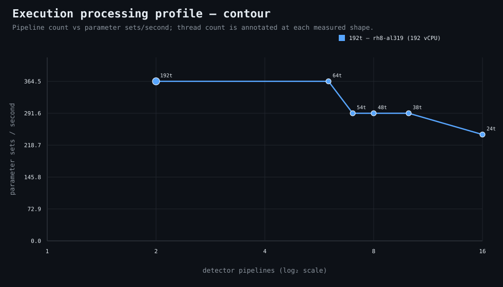

### Execution optimizer summary

Detector: `contour`  
Optimizer run: **31534268535** — execution data below contains only shapes completed in this execution; the preferred configuration may use all compatible completed optimizer evidence.

<strong>Navigation</strong>

- [Preferred Detector Run Configuration](#preferred-detector-run-configuration)
- [Detector Run Profile Plot](#detector-run-profile-plot)
- [Detector Pipeline-Thread Shape Optimization Data](#detector-pipeline-thread-shape-optimization-data)

<strong>1. Preferred Detector Run Configuration</strong>

Compatible completed optimizer runs are coalesced by detector, workload, and concrete runner profile. Repeated shapes retain all observations; the preferred shape is selected canonically by throughput, then lower resource use for throughput-equivalent shapes.

| Detector | Runner | CPU | Physical | Logical | RAM | Preferred pipelines | Threads / pipeline | Preferred shape range (≤2%) | Search method | Optimization time | Allocated | Sets/s | Shape time | Observations |
|---|---|---|---:|---:|---:|---:|---:|---|---|---:|---:|---:|---:|---:|
| contour | 192t — rh8-al319 (192 vCPU) | AMD EPYC 9655 96-Core Processor | 192 | 192 | 1511.3 GiB | 7 | 54 | 2p/192t, 3p/128t, 4p/96t, 5p/76t, 6p/64t, 7p/54t, 8p/48t | adaptive | 56s | 378 | 364.50 | 4s | 2 |

**Search method legend:** `adaptive` = sparse wide-range search with local refinement around the measured peak and ≤2% preferred-shape boundaries; `powers-of-2` = logarithmic power-of-two pipeline sweep; `exhaustive` = every legal pipeline count in the requested range.

**Shape-prediction coverage:** vCPU anchors `192`; readiness **low**; prediction checks **0 verified / 0 pending**.
**Desired / missing optimization data:** missing: a second vCPU size to establish shape scaling.

[↑ Back to Navigation](#table-of-contents)

<strong>2. Detector Run Profile Plot</strong>

Compatible completed measurements are plotted as detector pipelines versus parameter sets/second; thread count is annotated at each measured shape.
**Search method:** `adaptive`

[↑ Back to Navigation](#table-of-contents)

<strong>3. Detector Pipeline-Thread Shape Optimization Data</strong>

Shapes completed in this execution are shown below.

| Runner | Pipelines | Shards | Threads / pipeline | Allocated | Wall | Sets/s | Speedup | Δ from best | Avg load | Peak load | Avg CPU | Peak RAM |
|---|---:|---:|---:|---:|---:|---:|---:|---:|---:|---:|---:|---:|
| 192t — rh8-al319 (192 vCPU) | 1 | 1 | 384 | 384 | 6s | 243.00 | 1.00× | -33.33% | — | — | — | — |
| 192t — rh8-al319 (192 vCPU) | 2 | 2 | 192 | 384 | 4s | 364.50 | 1.50× | 0.00% | — | — | — | — |
| 192t — rh8-al319 (192 vCPU) | 3 | 3 | 128 | 384 | 4s | 364.50 | 1.50× | 0.00% | — | — | — | — |
| 192t — rh8-al319 (192 vCPU) | 4 | 4 | 96 | 384 | 4s | 364.50 | 1.50× | 0.00% | — | — | — | — |
| 192t — rh8-al319 (192 vCPU) | 5 | 5 | 76 | 380 | 4s | 364.50 | 1.50× | 0.00% | — | — | — | — |
| 192t — rh8-al319 (192 vCPU) | 6 | 6 | 64 | 384 | 4s | 364.50 | 1.50× | 0.00% | — | — | — | — |
| **192t — rh8-al319 (192 vCPU)** | 7 | 7 | 54 | 378 | 4s | 364.50 | 1.50× | 0.00% | — | — | — | — |
| 192t — rh8-al319 (192 vCPU) | 8 | 8 | 48 | 384 | 4s | 364.50 | 1.50× | 0.00% | — | — | — | — |
| 192t — rh8-al319 (192 vCPU) | 9 | 9 | 42 | 378 | 5s | 291.60 | 1.20× | -20.00% | 62.2 | 62.2 | 11.3% | 10.9 GiB |
| 192t — rh8-al319 (192 vCPU) | 32 | 32 | 12 | 384 | 12s | 121.50 | 0.50× | -66.67% | — | — | — | — |

**Early stop:** throughput plateau detected after 3 consecutive completed shapes improved by less than 2.0% from the perceived maximum.

[↑ Back to Navigation](#table-of-contents)
