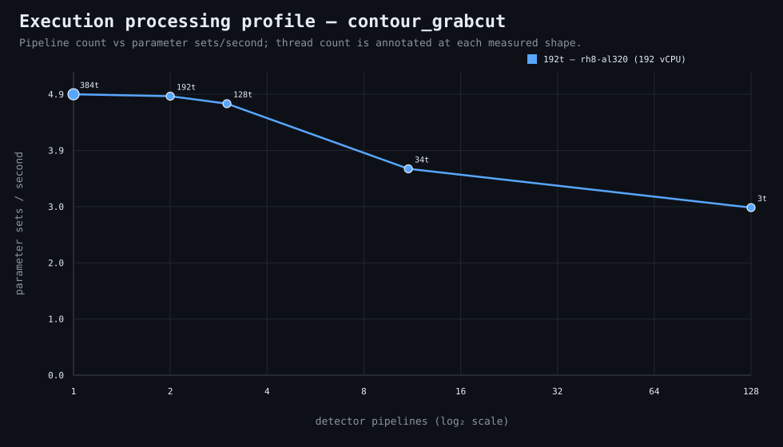

### Execution optimizer summary

Detector: `contour_grabcut`  
Optimizer run: **31332741953** — execution data below contains only shapes completed in this execution; the preferred configuration may use all compatible completed optimizer evidence.

<strong>Navigation</strong>

- [Preferred Detector Run Configuration](#preferred-detector-run-configuration)
- [Detector Run Profile Plot](#detector-run-profile-plot)
- [Detector Pipeline-Thread Shape Optimization Data](#detector-pipeline-thread-shape-optimization-data)

<strong>1. Preferred Detector Run Configuration</strong>

Compatible completed optimizer runs are coalesced by detector, workload, and concrete runner profile. Repeated shapes retain all observations; the preferred shape is the fastest measured compatible shape.

| Detector | Runner | CPU | Physical | Logical | RAM | Preferred pipelines | Threads / pipeline | Preferred shape range (≤2%) | Search method | Optimization time | Allocated | Sets/s | Shape time | Observations |
|---|---|---|---:|---:|---:|---:|---:|---|---|---:|---:|---:|---:|---:|
| contour_grabcut | 192t — rh8-al320 (192 vCPU) | AMD EPYC 9655 96-Core Processor | 192 | 192 | 1511.3 GiB | 1 | 384 | 1p/384t, 2p/192t | adaptive | 2h 14m 47s | 384 | 4.93 | 22m 10s | 1 |

[↑ Back to Navigation](#table-of-contents)

<strong>2. Detector Run Profile Plot</strong>

Compatible completed measurements are plotted as detector pipelines versus parameter sets/second; thread count is annotated at each measured shape.
**Search method:** `adaptive`

[↑ Back to Navigation](#table-of-contents)

<strong>3. Detector Pipeline-Thread Shape Optimization Data</strong>

Shapes completed in this execution are shown below.

| Runner | Pipelines | Shards | Threads / pipeline | Allocated | Wall | Sets/s | Speedup | Δ from best | Avg load | Peak load | Avg CPU | Peak RAM |
|---|---:|---:|---:|---:|---:|---:|---:|---:|---:|---:|---:|---:|
| **192t — rh8-al320 (192 vCPU)** | 1 | 1 | 384 | 384 | 22m 10s | 4.93 | 1.00× | 0.00% | 366.6 | 429.7 | 91.5% | 60.2 GiB |
| 192t — rh8-al320 (192 vCPU) | 2 | 2 | 192 | 384 | 22m 19s | 4.90 | 0.99× | -0.67% | 504.4 | 550.8 | 94.2% | 62.0 GiB |
| 192t — rh8-al320 (192 vCPU) | 3 | 3 | 128 | 384 | 22m 56s | 4.77 | 0.97× | -3.34% | 599.2 | 700.1 | 93.7% | 75.1 GiB |
| 192t — rh8-al320 (192 vCPU) | 11 | 11 | 34 | 374 | 30m 10s | 3.63 | 0.73× | -26.52% | 1096.2 | 1233.8 | 96.8% | 84.6 GiB |
| 192t — rh8-al320 (192 vCPU) | 128 | 128 | 3 | 384 | 37m 9s | 2.94 | 0.60× | -40.33% | 1782.4 | 2079.5 | 98.5% | 105.1 GiB |

**Early stop:** throughput plateau detected after 3 consecutive completed shapes improved by less than 2.0% from the perceived maximum.

[↑ Back to Navigation](#table-of-contents)
