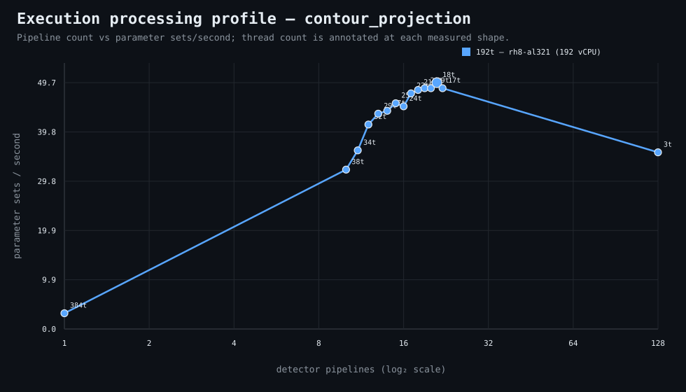

### Execution optimizer summary

Detector: `contour_projection`  
Optimizer run: **31332625127** — execution data below contains only shapes completed in this execution; the preferred configuration may use all compatible completed optimizer evidence.

<strong>Navigation</strong>

- [Preferred Detector Run Configuration](#preferred-detector-run-configuration)
- [Detector Run Profile Plot](#detector-run-profile-plot)
- [Detector Pipeline-Thread Shape Optimization Data](#detector-pipeline-thread-shape-optimization-data)

<strong>1. Preferred Detector Run Configuration</strong>

Compatible completed optimizer runs are coalesced by detector, workload, and concrete runner profile. Repeated shapes retain all observations; the preferred shape is the fastest measured compatible shape.

| Detector | Runner | CPU | Physical | Logical | RAM | Preferred pipelines | Threads / pipeline | Preferred shape range (≤2%) | Search method | Optimization time | Allocated | Sets/s | Shape time | Observations |
|---|---|---|---:|---:|---:|---:|---:|---|---|---:|---:|---:|---:|---:|
| contour_projection | 192t — rh8-al321 (192 vCPU) | AMD EPYC 9655 96-Core Processor | 192 | 192 | 1511.3 GiB | 21 | 18 | 21p/18t | adaptive | 1h 9m 57s | 378 | 49.71 | 2m 12s | 1 |

[↑ Back to Navigation](#table-of-contents)

<strong>2. Detector Run Profile Plot</strong>

Compatible completed measurements are plotted as detector pipelines versus parameter sets/second; thread count is annotated at each measured shape.
**Search method:** `adaptive`

[↑ Back to Navigation](#table-of-contents)

<strong>3. Detector Pipeline-Thread Shape Optimization Data</strong>

Shapes completed in this execution are shown below.

| Runner | Pipelines | Shards | Threads / pipeline | Allocated | Wall | Sets/s | Speedup | Δ from best | Avg load | Peak load | Avg CPU | Peak RAM |
|---|---:|---:|---:|---:|---:|---:|---:|---:|---:|---:|---:|---:|
| 192t — rh8-al321 (192 vCPU) | 1 | 1 | 384 | 384 | 34m 26s | 3.18 | 1.00× | -93.61% | 7.1 | 28.3 | 4.0% | 16.4 GiB |
| 192t — rh8-al321 (192 vCPU) | 10 | 10 | 38 | 380 | 3m 24s | 32.17 | 10.13× | -35.29% | 1322.6 | 1398.2 | 83.4% | 17.3 GiB |
| 192t — rh8-al321 (192 vCPU) | 11 | 11 | 34 | 374 | 3m 2s | 36.05 | 11.35× | -27.47% | 1631.2 | 1749.7 | 91.5% | 17.4 GiB |
| 192t — rh8-al321 (192 vCPU) | 12 | 12 | 32 | 384 | 2m 39s | 41.27 | 12.99× | -16.98% | 1316.0 | 1518.0 | 92.2% | 17.6 GiB |
| 192t — rh8-al321 (192 vCPU) | 13 | 13 | 29 | 377 | 2m 31s | 43.46 | 13.68× | -12.58% | 1397.5 | 1502.5 | 91.9% | 17.6 GiB |
| 192t — rh8-al321 (192 vCPU) | 14 | 14 | 27 | 378 | 2m 29s | 44.04 | 13.87× | -11.41% | 1483.2 | 1541.3 | 97.8% | 17.7 GiB |
| 192t — rh8-al321 (192 vCPU) | 15 | 15 | 25 | 375 | 2m 24s | 45.57 | 14.35× | -8.33% | 1423.3 | 1483.7 | 92.9% | 17.7 GiB |
| 192t — rh8-al321 (192 vCPU) | 16 | 16 | 24 | 384 | 2m 26s | 44.95 | 14.15× | -9.59% | 1565.7 | 1609.1 | 95.4% | 18.0 GiB |
| 192t — rh8-al321 (192 vCPU) | 17 | 17 | 22 | 374 | 2m 18s | 47.55 | 14.97× | -4.35% | 1408.5 | 1466.7 | 89.9% | 17.9 GiB |
| 192t — rh8-al321 (192 vCPU) | 18 | 18 | 21 | 378 | 2m 16s | 48.25 | 15.19× | -2.94% | 1396.7 | 1472.8 | 92.8% | 18.1 GiB |
| 192t — rh8-al321 (192 vCPU) | 19 | 19 | 20 | 380 | 2m 15s | 48.61 | 15.30× | -2.22% | 1373.0 | 1507.7 | 94.8% | 18.2 GiB |
| 192t — rh8-al321 (192 vCPU) | 20 | 20 | 19 | 380 | 2m 15s | 48.61 | 15.30× | -2.22% | 1538.1 | 1577.0 | 96.6% | 18.4 GiB |
| **192t — rh8-al321 (192 vCPU)** | 21 | 21 | 18 | 378 | 2m 12s | 49.71 | 15.65× | 0.00% | 1516.3 | 1567.4 | 92.8% | 18.4 GiB |
| 192t — rh8-al321 (192 vCPU) | 22 | 22 | 17 | 374 | 2m 15s | 48.61 | 15.30× | -2.22% | 1508.4 | 1532.1 | 94.7% | 18.5 GiB |
| 192t — rh8-al321 (192 vCPU) | 128 | 128 | 3 | 384 | 3m 4s | 35.66 | 11.23× | -28.26% | 1817.4 | 2605.0 | 82.9% | 30.3 GiB |

**Stop reason:** `adaptive_search_complete`

[↑ Back to Navigation](#table-of-contents)
