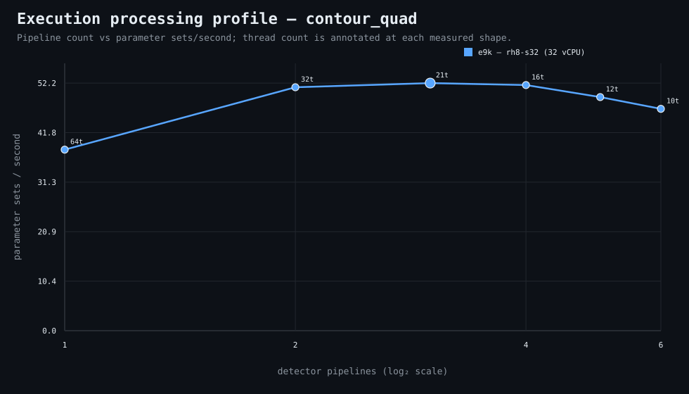

### Execution optimizer summary

Detector: `contour_quad`  
Optimizer run: **31352140380** — execution data below contains only shapes completed in this execution; the preferred configuration may use all compatible completed optimizer evidence.

<strong>Navigation</strong>

- [Preferred Detector Run Configuration](#preferred-detector-run-configuration)
- [Detector Run Profile Plot](#detector-run-profile-plot)
- [Detector Pipeline-Thread Shape Optimization Data](#detector-pipeline-thread-shape-optimization-data)

<strong>1. Preferred Detector Run Configuration</strong>

Compatible completed optimizer runs are coalesced by detector, workload, and concrete runner profile. Repeated shapes retain all observations; the preferred shape is selected canonically by throughput, then lower resource use for throughput-equivalent shapes.

| Detector | Runner | CPU | Physical | Logical | RAM | Preferred pipelines | Threads / pipeline | Preferred shape range (≤2%) | Search method | Optimization time | Allocated | Sets/s | Shape time | Observations |
|---|---|---|---:|---:|---:|---:|---:|---|---|---:|---:|---:|---:|---:|
| contour_quad | 192t — rh8-al324 (192 vCPU) | AMD EPYC 9655 96-Core Processor | 192 | 192 | 1511.3 GiB | 8 | 48 | 6p/64t, 7p/54t, 8p/48t, 9p/42t, 10p/38t | adaptive | 1d 45m 49s | 384 | 146.81 | 2h 40s | 1 |
| contour_quad | e9k — rh8-s32 (32 vCPU) | AMD EPYC 9175F 16-Core Processor | 16 | 32 | 1511.3 GiB | 3 | 21 | 2p/32t, 3p/21t, 4p/16t | exhaustive | 1d 13h 7m 7s | 63 | 52.24 | 5h 39m 5s | 1 |

[↑ Back to Navigation](#table-of-contents)

<strong>2. Detector Run Profile Plot</strong>

Compatible completed measurements are plotted as detector pipelines versus parameter sets/second; thread count is annotated at each measured shape.
**Search method:** `adaptive`

[↑ Back to Navigation](#table-of-contents)

<strong>3. Detector Pipeline-Thread Shape Optimization Data</strong>

Shapes completed in this execution are shown below.

| Runner | Pipelines | Shards | Threads / pipeline | Allocated | Wall | Sets/s | Speedup | Δ from best | Avg load | Peak load | Avg CPU | Peak RAM |
|---|---:|---:|---:|---:|---:|---:|---:|---:|---:|---:|---:|---:|
| 192t — rh8-al324 (192 vCPU) | 1 | 1 | 384 | 384 | 7h 3m 20s | 41.85 | 1.00× | -71.50% | 68.4 | 97.7 | 40.3% | 43.1 GiB |
| 192t — rh8-al324 (192 vCPU) | 5 | 5 | 76 | 380 | 2h 10m 13s | 136.04 | 3.25× | -7.33% | 716.6 | 849.0 | 90.6% | 44.2 GiB |
| 192t — rh8-al324 (192 vCPU) | 6 | 6 | 64 | 384 | 2h 2m 31s | 144.59 | 3.46× | -1.51% | 810.0 | 942.6 | 92.4% | 43.5 GiB |
| 192t — rh8-al324 (192 vCPU) | 7 | 7 | 54 | 378 | 2h 1m 25s | 145.90 | 3.49× | -0.62% | 838.8 | 1010.0 | 92.0% | 42.7 GiB |
| **192t — rh8-al324 (192 vCPU)** | 8 | 8 | 48 | 384 | 2h 40s | 146.81 | 3.51× | 0.00% | 912.3 | 1088.9 | 93.2% | 44.6 GiB |
| 192t — rh8-al324 (192 vCPU) | 9 | 9 | 42 | 378 | 2h 1m 28s | 145.84 | 3.49× | -0.66% | 969.3 | 1174.2 | 93.5% | 45.3 GiB |
| 192t — rh8-al324 (192 vCPU) | 10 | 10 | 38 | 380 | 2h 3m 7s | 143.89 | 3.44× | -1.99% | 978.4 | 1149.2 | 93.4% | 43.7 GiB |
| 192t — rh8-al324 (192 vCPU) | 11 | 11 | 34 | 374 | 2h 3m 56s | 142.94 | 3.42× | -2.64% | 1056.6 | 1212.6 | 94.3% | 47.5 GiB |
| 192t — rh8-al324 (192 vCPU) | 128 | 128 | 3 | 384 | 3h 19m 3s | 89.00 | 2.13× | -39.38% | 6124.3 | 6996.3 | 97.3% | 127.1 GiB |

**Early stop:** throughput plateau detected after 3 consecutive completed shapes improved by less than 2.0% from the perceived maximum.

[↑ Back to Navigation](#table-of-contents)
