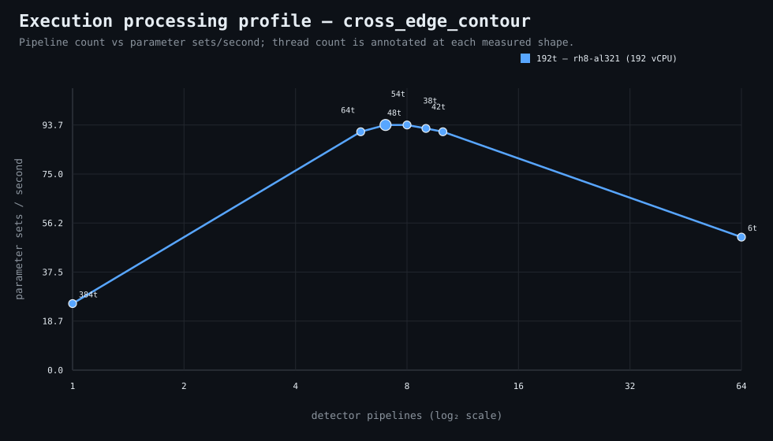

### Execution optimizer summary

Detector: `cross_edge_contour`  
Optimizer run: **31336449312** — execution data below contains only shapes completed in this execution; the preferred configuration may use all compatible completed optimizer evidence.

<strong>Navigation</strong>

- [Preferred Detector Run Configuration](#preferred-detector-run-configuration)
- [Detector Run Profile Plot](#detector-run-profile-plot)
- [Detector Pipeline-Thread Shape Optimization Data](#detector-pipeline-thread-shape-optimization-data)

<strong>1. Preferred Detector Run Configuration</strong>

Compatible completed optimizer runs are coalesced by detector, workload, and concrete runner profile. Repeated shapes retain all observations; the preferred shape is selected canonically by throughput, then lower resource use for throughput-equivalent shapes.

| Detector | Runner | CPU | Physical | Logical | RAM | Preferred pipelines | Threads / pipeline | Preferred shape range (≤2%) | Search method | Optimization time | Allocated | Sets/s | Shape time | Observations |
|---|---|---|---:|---:|---:|---:|---:|---|---|---:|---:|---:|---:|---:|
| cross_edge_contour | 192t — rh8-al321 (192 vCPU) | AMD EPYC 9655 96-Core Processor | 192 | 192 | 1511.3 GiB | 7 | 54 | 7p/54t, 8p/48t, 9p/42t | adaptive | 12m 27s | 378 | 93.74 | 1m 10s | 2 |

[↑ Back to Navigation](#table-of-contents)

<strong>2. Detector Run Profile Plot</strong>

Compatible completed measurements are plotted as detector pipelines versus parameter sets/second; thread count is annotated at each measured shape.
**Search method:** `adaptive`

[↑ Back to Navigation](#table-of-contents)

<strong>3. Detector Pipeline-Thread Shape Optimization Data</strong>

Shapes completed in this execution are shown below.

| Runner | Pipelines | Shards | Threads / pipeline | Allocated | Wall | Sets/s | Speedup | Δ from best | Avg load | Peak load | Avg CPU | Peak RAM |
|---|---:|---:|---:|---:|---:|---:|---:|---:|---:|---:|---:|---:|
| 192t — rh8-al321 (192 vCPU) | 1 | 1 | 384 | 384 | 4m 18s | 25.43 | 1.00× | -72.87% | 142.1 | 270.3 | 37.4% | 18.6 GiB |
| 192t — rh8-al321 (192 vCPU) | 6 | 6 | 64 | 384 | 1m 12s | 91.14 | 3.58× | -2.78% | 984.0 | 1023.8 | 95.2% | 18.0 GiB |
| **192t — rh8-al321 (192 vCPU)** | 7 | 7 | 54 | 378 | 1m 10s | 93.74 | 3.69× | 0.00% | 1273.6 | 1273.6 | 92.9% | 17.5 GiB |
| 192t — rh8-al321 (192 vCPU) | 8 | 8 | 48 | 384 | 1m 10s | 93.74 | 3.69× | 0.00% | 1896.8 | 1896.8 | 88.1% | 17.8 GiB |
| 192t — rh8-al321 (192 vCPU) | 9 | 9 | 42 | 378 | 1m 11s | 92.42 | 3.63× | -1.41% | 992.4 | 992.4 | 93.5% | 18.1 GiB |
| 192t — rh8-al321 (192 vCPU) | 10 | 10 | 38 | 380 | 1m 12s | 91.14 | 3.58× | -2.78% | 1072.3 | 1072.3 | 93.2% | 18.1 GiB |
| 192t — rh8-al321 (192 vCPU) | 64 | 64 | 6 | 384 | 2m 10s | 50.48 | 1.98× | -46.15% | 2018.7 | 2608.0 | 86.9% | 26.6 GiB |

**Early stop:** throughput plateau detected after 3 consecutive completed shapes improved by less than 2.0% from the perceived maximum.

[↑ Back to Navigation](#table-of-contents)
