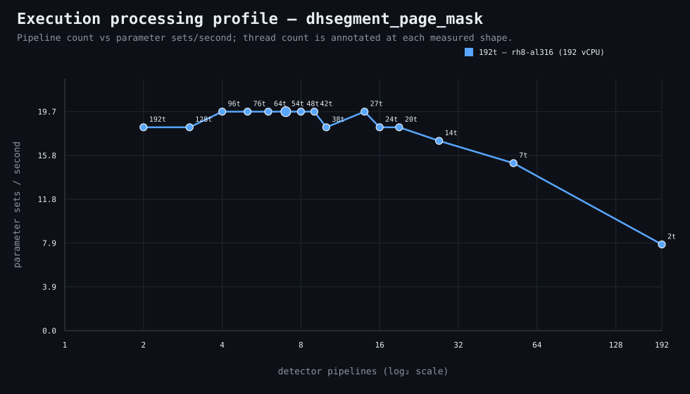

### Execution optimizer summary

Detector: `dhsegment_page_mask`  
Optimizer run: **31855551869** — execution data below contains only shapes completed in this execution; the preferred configuration may use all compatible completed optimizer evidence.

<strong>Navigation</strong>

- [Preferred Detector Run Configuration](#preferred-detector-run-configuration)
- [Detector Run Profile Plot](#detector-run-profile-plot)
- [Detector Pipeline-Thread Shape Optimization Data](#detector-pipeline-thread-shape-optimization-data)

<strong>1. Preferred Detector Run Configuration</strong>

Compatible completed optimizer runs are coalesced by detector, workload, and concrete runner profile. Repeated shapes retain all observations; the preferred shape is selected canonically by throughput, then lower resource use for throughput-equivalent shapes.

| Detector | Runner | CPU | Physical | Logical | RAM | Preferred pipelines | Threads / pipeline | Preferred shape range (≤2%) | Search method | Optimization time | Allocated | Sets/s | Shape time | Observations |
|---|---|---|---:|---:|---:|---:|---:|---|---|---:|---:|---:|---:|---:|
| dhsegment_page_mask | 192t — rh8-al308 (192 vCPU) | AMD EPYC 9655 96-Core Processor | 192 | 192 | 6047.3 GiB | 32 | 12 | 32p/12t | adaptive | 1d 3h 48m 24s | 384 | 4.24 | 39m 18s | 1 |

**Search method legend:** `adaptive` = sparse wide-range search with local refinement around the measured peak and ≤2% preferred-shape boundaries; `powers-of-2` = logarithmic power-of-two pipeline sweep; `exhaustive` = every legal pipeline count in the requested range.

**Shape-prediction coverage:** vCPU anchors `192`; readiness **low**; prediction checks **0 verified / 0 pending**.
**Desired / missing optimization data:** missing: a second vCPU size to establish shape scaling.

[↑ Back to Navigation](#table-of-contents)

<strong>2. Detector Run Profile Plot</strong>

Compatible completed measurements are plotted as detector pipelines versus parameter sets/second; thread count is annotated at each measured shape.
**Search method:** `adaptive`

[↑ Back to Navigation](#table-of-contents)

<strong>3. Detector Pipeline-Thread Shape Optimization Data</strong>

Shapes completed in this execution are shown below.

This table contains measurements from this optimizer execution only. Bold identifies this run’s measured throughput winner; the preferred configuration above is selected from all compatible coalesced optimizer evidence.

| Runner | Pipelines | Shards | Threads / pipeline | Allocated | Wall | Sets/s | Speedup | Δ from run best | Avg load | Peak load | Avg CPU | Peak RAM |
|---|---:|---:|---:|---:|---:|---:|---:|---:|---:|---:|---:|---:|
| 192t — rh8-al308 (192 vCPU) | 1 | 1 | 384 | 384 | 18h 46m 39s | 0.15 | 1.00× | -96.51% | 1.1 | 5.3 | 0.6% | 31.1 GiB |
| 192t — rh8-al308 (192 vCPU) | 6 | 6 | 64 | 384 | 3h 8m 47s | 0.88 | 5.97× | -79.18% | 6.5 | 39.6 | 3.3% | 36.2 GiB |
| 192t — rh8-al308 (192 vCPU) | 14 | 14 | 27 | 378 | 1h 22m 5s | 2.03 | 13.73× | -52.12% | 16.2 | 96.9 | 7.6% | 44.4 GiB |
| 192t — rh8-al308 (192 vCPU) | 21 | 21 | 18 | 378 | 56m 21s | 2.96 | 19.99× | -30.26% | 22.6 | 40.0 | 11.3% | 51.8 GiB |
| 192t — rh8-al308 (192 vCPU) | 26 | 26 | 14 | 364 | 47m 13s | 3.53 | 23.86× | -16.77% | 27.8 | 36.8 | 14.1% | 57.1 GiB |
| 192t — rh8-al308 (192 vCPU) | 29 | 29 | 13 | 377 | 44m 10s | 3.77 | 25.51× | -11.02% | 30.3 | 52.5 | 15.3% | 60.2 GiB |
| 192t — rh8-al308 (192 vCPU) | 30 | 30 | 12 | 360 | 41m 51s | 3.98 | 26.92× | -6.09% | 36.0 | 143.9 | 16.2% | 60.9 GiB |
| 192t — rh8-al308 (192 vCPU) | 31 | 31 | 12 | 372 | 41m 54s | 3.98 | 26.89× | -6.21% | 31.4 | 36.6 | 16.2% | 62.2 GiB |
| **192t — rh8-al308 (192 vCPU)** | 32 | 32 | 12 | 384 | 39m 18s | 4.24 | 28.67× | 0.00% | 31.9 | 36.2 | 17.0% | 63.5 GiB |

**Early stop:** throughput plateau detected after 3 consecutive completed shapes improved by less than 2.0% from the perceived maximum.

[↑ Back to Navigation](#table-of-contents)
