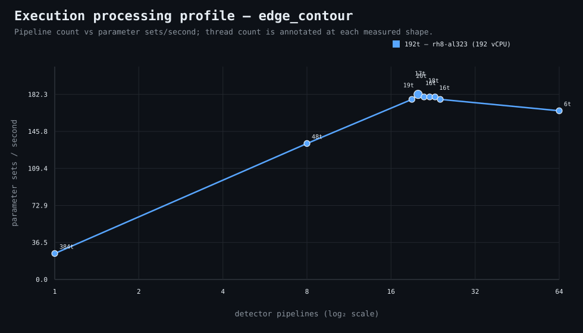

### Execution optimizer summary

Detector: `edge_contour`  
Optimizer run: **31335967890** — execution data below contains only shapes completed in this execution; the preferred configuration may use all compatible completed optimizer evidence.

<strong>Navigation</strong>

- [Preferred Detector Run Configuration](#preferred-detector-run-configuration)
- [Detector Run Profile Plot](#detector-run-profile-plot)
- [Detector Pipeline-Thread Shape Optimization Data](#detector-pipeline-thread-shape-optimization-data)

<strong>1. Preferred Detector Run Configuration</strong>

Compatible completed optimizer runs are coalesced by detector, workload, and concrete runner profile. Repeated shapes retain all observations; the preferred shape is selected canonically by throughput, then lower resource use for throughput-equivalent shapes.

| Detector | Runner | CPU | Physical | Logical | RAM | Preferred pipelines | Threads / pipeline | Preferred shape range (≤2%) | Search method | Optimization time | Allocated | Sets/s | Shape time | Observations |
|---|---|---|---:|---:|---:|---:|---:|---|---|---:|---:|---:|---:|---:|
| edge_contour | 192t — rh8-al323 (192 vCPU) | AMD EPYC 9655 96-Core Processor | 192 | 192 | 1511.3 GiB | 20 | 19 | 20p/19t, 21p/18t, 22p/17t, 23p/16t | adaptive | 18m 51s | 380 | 182.26 | 1m 12s | 1 |

[↑ Back to Navigation](#table-of-contents)

<strong>2. Detector Run Profile Plot</strong>

Compatible completed measurements are plotted as detector pipelines versus parameter sets/second; thread count is annotated at each measured shape.
**Search method:** `adaptive`

[↑ Back to Navigation](#table-of-contents)

<strong>3. Detector Pipeline-Thread Shape Optimization Data</strong>

Shapes completed in this execution are shown below.

| Runner | Pipelines | Shards | Threads / pipeline | Allocated | Wall | Sets/s | Speedup | Δ from best | Avg load | Peak load | Avg CPU | Peak RAM |
|---|---:|---:|---:|---:|---:|---:|---:|---:|---:|---:|---:|---:|
| 192t — rh8-al323 (192 vCPU) | 1 | 1 | 384 | 384 | 8m 33s | 25.58 | 1.00× | -85.96% | 12.8 | 14.7 | 6.9% | 29.5 GiB |
| 192t — rh8-al323 (192 vCPU) | 8 | 8 | 48 | 384 | 1m 38s | 133.91 | 5.23× | -26.53% | 543.9 | 741.2 | 71.3% | 30.7 GiB |
| 192t — rh8-al323 (192 vCPU) | 19 | 19 | 20 | 380 | 1m 14s | 177.34 | 6.93× | -2.70% | 795.3 | 795.3 | 88.2% | 33.5 GiB |
| **192t — rh8-al323 (192 vCPU)** | 20 | 20 | 19 | 380 | 1m 12s | 182.26 | 7.12× | 0.00% | 703.5 | 703.5 | 87.8% | 34.0 GiB |
| 192t — rh8-al323 (192 vCPU) | 21 | 21 | 18 | 378 | 1m 13s | 179.77 | 7.03× | -1.37% | 762.3 | 762.3 | 95.7% | 34.4 GiB |
| 192t — rh8-al323 (192 vCPU) | 22 | 22 | 17 | 374 | 1m 13s | 179.77 | 7.03× | -1.37% | 655.1 | 710.6 | 89.3% | 33.7 GiB |
| 192t — rh8-al323 (192 vCPU) | 23 | 23 | 16 | 368 | 1m 13s | 179.77 | 7.03× | -1.37% | 408.9 | 408.9 | 68.0% | 33.7 GiB |
| 192t — rh8-al323 (192 vCPU) | 24 | 24 | 16 | 384 | 1m 14s | 177.34 | 6.93× | -2.70% | 725.2 | 725.2 | 87.3% | 34.8 GiB |
| 192t — rh8-al323 (192 vCPU) | 64 | 64 | 6 | 384 | 1m 19s | 166.11 | 6.49× | -8.86% | 384.2 | 384.2 | 38.1% | 38.9 GiB |

**Early stop:** throughput plateau detected after 3 consecutive completed shapes improved by less than 2.0% from the perceived maximum.

[↑ Back to Navigation](#table-of-contents)
