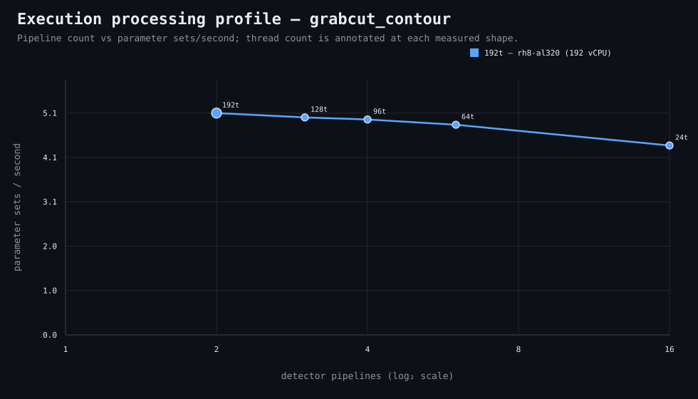

### Execution optimizer summary

Detector: `grabcut_contour`  
Optimizer run: **31533984821** — execution data below contains only shapes completed in this execution; the preferred configuration may use all compatible completed optimizer evidence.

<strong>Navigation</strong>

- [Preferred Detector Run Configuration](#preferred-detector-run-configuration)
- [Detector Run Profile Plot](#detector-run-profile-plot)
- [Detector Pipeline-Thread Shape Optimization Data](#detector-pipeline-thread-shape-optimization-data)

<strong>1. Preferred Detector Run Configuration</strong>

Compatible completed optimizer runs are coalesced by detector, workload, and concrete runner profile. Repeated shapes retain all observations; the preferred shape is selected canonically by throughput, then lower resource use for throughput-equivalent shapes.

| Detector | Runner | CPU | Physical | Logical | RAM | Preferred pipelines | Threads / pipeline | Preferred shape range (≤2%) | Search method | Optimization time | Allocated | Sets/s | Shape time | Observations |
|---|---|---|---:|---:|---:|---:|---:|---|---|---:|---:|---:|---:|---:|
| grabcut_contour | 192t — rh8-al320 (192 vCPU) | AMD EPYC 9655 96-Core Processor | 192 | 192 | 1511.3 GiB | 2 | 192 | 2p/192t, 3p/128t | adaptive | 4d 5h 26m 33s | 384 | 5.12 | 19h 13m 32s | 1 |

**Search method legend:** `adaptive` = sparse wide-range search with local refinement around the measured peak and ≤2% preferred-shape boundaries; `powers-of-2` = logarithmic power-of-two pipeline sweep; `exhaustive` = every legal pipeline count in the requested range.

**Shape-prediction coverage:** vCPU anchors `192`; readiness **low**; prediction checks **0 verified / 0 pending**.
**Desired / missing optimization data:** missing: a second vCPU size to establish shape scaling.

[↑ Back to Navigation](#table-of-contents)

<strong>2. Detector Run Profile Plot</strong>

Compatible completed measurements are plotted as detector pipelines versus parameter sets/second; thread count is annotated at each measured shape.
**Search method:** `adaptive`

[↑ Back to Navigation](#table-of-contents)

<strong>3. Detector Pipeline-Thread Shape Optimization Data</strong>

Shapes completed in this execution are shown below.

| Runner | Pipelines | Shards | Threads / pipeline | Allocated | Wall | Sets/s | Speedup | Δ from best | Avg load | Peak load | Avg CPU | Peak RAM |
|---|---:|---:|---:|---:|---:|---:|---:|---:|---:|---:|---:|---:|
| **192t — rh8-al320 (192 vCPU)** | 2 | 2 | 192 | 384 | 19h 13m 32s | 5.12 | — | 0.00% | 562.0 | 655.0 | 96.0% | 87.2 GiB |
| 192t — rh8-al320 (192 vCPU) | 3 | 3 | 128 | 384 | 19h 36m 35s | 5.02 | — | -1.96% | 654.1 | 760.0 | 96.9% | 82.4 GiB |
| 192t — rh8-al320 (192 vCPU) | 4 | 4 | 96 | 384 | 19h 48m 5s | 4.97 | — | -2.91% | 730.8 | 876.6 | 97.7% | 86.8 GiB |
| 192t — rh8-al320 (192 vCPU) | 6 | 6 | 64 | 384 | 20h 17m 30s | 4.85 | — | -5.25% | 850.5 | 996.8 | 99.0% | 90.8 GiB |
| 192t — rh8-al320 (192 vCPU) | 16 | 16 | 24 | 384 | 22h 30m 47s | 4.37 | — | -14.60% | 1237.1 | 1552.0 | 99.7% | 100.7 GiB |

**Early stop:** throughput plateau detected after 3 consecutive completed shapes improved by less than 2.0% from the perceived maximum.

[↑ Back to Navigation](#table-of-contents)
