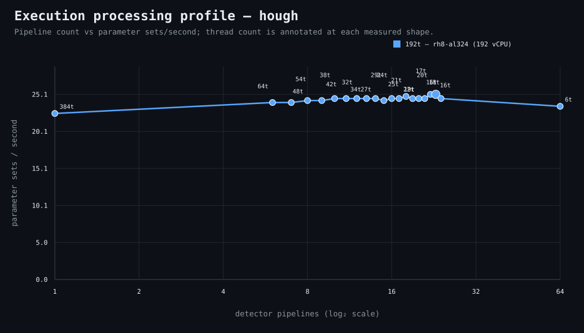

### Execution optimizer summary

Detector: `hough`  
Optimizer run: **31337690753** — execution data below contains only shapes completed in this execution; the preferred configuration may use all compatible completed optimizer evidence.

<strong>Navigation</strong>

- [Preferred Detector Run Configuration](#preferred-detector-run-configuration)
- [Detector Run Profile Plot](#detector-run-profile-plot)
- [Detector Pipeline-Thread Shape Optimization Data](#detector-pipeline-thread-shape-optimization-data)

<strong>1. Preferred Detector Run Configuration</strong>

Compatible completed optimizer runs are coalesced by detector, workload, and concrete runner profile. Repeated shapes retain all observations; the preferred shape is selected canonically by throughput, then lower resource use for throughput-equivalent shapes.

| Detector | Runner | CPU | Physical | Logical | RAM | Preferred pipelines | Threads / pipeline | Preferred shape range (≤2%) | Search method | Optimization time | Allocated | Sets/s | Shape time | Observations |
|---|---|---|---:|---:|---:|---:|---:|---|---|---:|---:|---:|---:|---:|
| hough | 192t — rh8-al324 (192 vCPU) | AMD EPYC 9655 96-Core Processor | 192 | 192 | 1511.3 GiB | 23 | 16 | 18p/21t, 22p/17t, 23p/16t | adaptive | 31m 29s | 368 | 25.15 | 1m 27s | 1 |

[↑ Back to Navigation](#table-of-contents)

<strong>2. Detector Run Profile Plot</strong>

Compatible completed measurements are plotted as detector pipelines versus parameter sets/second; thread count is annotated at each measured shape.
**Search method:** `adaptive`

[↑ Back to Navigation](#table-of-contents)

<strong>3. Detector Pipeline-Thread Shape Optimization Data</strong>

Shapes completed in this execution are shown below.

| Runner | Pipelines | Shards | Threads / pipeline | Allocated | Wall | Sets/s | Speedup | Δ from best | Avg load | Peak load | Avg CPU | Peak RAM |
|---|---:|---:|---:|---:|---:|---:|---:|---:|---:|---:|---:|---:|
| 192t — rh8-al324 (192 vCPU) | 1 | 1 | 384 | 384 | 1m 37s | 22.56 | 1.00× | -10.31% | 209.0 | 209.0 | 87.2% | 27.4 GiB |
| 192t — rh8-al324 (192 vCPU) | 6 | 6 | 64 | 384 | 1m 31s | 24.04 | 1.07× | -4.40% | 513.9 | 549.5 | 96.0% | 28.8 GiB |
| 192t — rh8-al324 (192 vCPU) | 7 | 7 | 54 | 378 | 1m 31s | 24.04 | 1.07× | -4.40% | 557.6 | 559.4 | 96.0% | 29.1 GiB |
| 192t — rh8-al324 (192 vCPU) | 8 | 8 | 48 | 384 | 1m 30s | 24.31 | 1.08× | -3.33% | 602.3 | 602.3 | 88.6% | 29.5 GiB |
| 192t — rh8-al324 (192 vCPU) | 9 | 9 | 42 | 378 | 1m 30s | 24.31 | 1.08× | -3.33% | 532.6 | 532.6 | 92.1% | 29.0 GiB |
| 192t — rh8-al324 (192 vCPU) | 10 | 10 | 38 | 380 | 1m 29s | 24.58 | 1.09× | -2.25% | 560.5 | 560.5 | 92.1% | 29.4 GiB |
| 192t — rh8-al324 (192 vCPU) | 11 | 11 | 34 | 374 | 1m 29s | 24.58 | 1.09× | -2.25% | 617.0 | 666.1 | 95.8% | 29.1 GiB |
| 192t — rh8-al324 (192 vCPU) | 12 | 12 | 32 | 384 | 1m 29s | 24.58 | 1.09× | -2.25% | 670.0 | 670.0 | 91.8% | 29.8 GiB |
| 192t — rh8-al324 (192 vCPU) | 13 | 13 | 29 | 377 | 1m 29s | 24.58 | 1.09× | -2.25% | 634.9 | 647.8 | 95.1% | 29.8 GiB |
| 192t — rh8-al324 (192 vCPU) | 14 | 14 | 27 | 378 | 1m 29s | 24.58 | 1.09× | -2.25% | 599.5 | 599.5 | 91.6% | 29.9 GiB |
| 192t — rh8-al324 (192 vCPU) | 15 | 15 | 25 | 375 | 1m 30s | 24.31 | 1.08× | -3.33% | 576.3 | 631.9 | 95.8% | 30.6 GiB |
| 192t — rh8-al324 (192 vCPU) | 16 | 16 | 24 | 384 | 1m 29s | 24.58 | 1.09× | -2.25% | 641.7 | 641.7 | 91.4% | 31.1 GiB |
| 192t — rh8-al324 (192 vCPU) | 17 | 17 | 22 | 374 | 1m 29s | 24.58 | 1.09× | -2.25% | 658.3 | 672.6 | 95.6% | 31.4 GiB |
| 192t — rh8-al324 (192 vCPU) | 18 | 18 | 21 | 378 | 1m 28s | 24.86 | 1.10× | -1.14% | 666.9 | 666.9 | 91.2% | 31.0 GiB |
| 192t — rh8-al324 (192 vCPU) | 19 | 19 | 20 | 380 | 1m 29s | 24.58 | 1.09× | -2.25% | 689.3 | 789.5 | 94.9% | 31.7 GiB |
| 192t — rh8-al324 (192 vCPU) | 20 | 20 | 19 | 380 | 1m 29s | 24.58 | 1.09× | -2.25% | 693.0 | 693.0 | 92.3% | 31.0 GiB |
| 192t — rh8-al324 (192 vCPU) | 21 | 21 | 18 | 378 | 1m 29s | 24.58 | 1.09× | -2.25% | 610.0 | 611.0 | 93.3% | 31.7 GiB |
| 192t — rh8-al324 (192 vCPU) | 22 | 22 | 17 | 374 | 1m 27s | 25.15 | 1.11× | 0.00% | 695.8 | 695.8 | 94.3% | 31.4 GiB |
| **192t — rh8-al324 (192 vCPU)** | 23 | 23 | 16 | 368 | 1m 27s | 25.15 | 1.11× | 0.00% | 610.3 | 610.3 | 90.7% | 31.9 GiB |
| 192t — rh8-al324 (192 vCPU) | 24 | 24 | 16 | 384 | 1m 29s | 24.58 | 1.09× | -2.25% | 661.8 | 696.0 | 95.3% | 32.2 GiB |
| 192t — rh8-al324 (192 vCPU) | 64 | 64 | 6 | 384 | 1m 33s | 23.53 | 1.04× | -6.45% | 532.6 | 623.4 | 96.5% | 38.2 GiB |

**Early stop:** throughput plateau detected after 3 consecutive completed shapes improved by less than 2.0% from the perceived maximum.

[↑ Back to Navigation](#table-of-contents)
