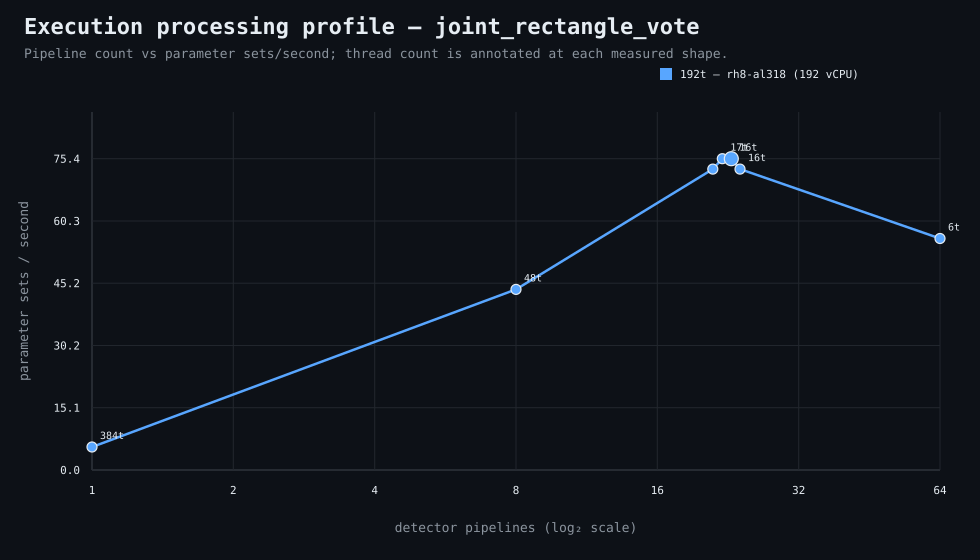

### Execution optimizer summary

Detector: `joint_rectangle_vote`  
Optimizer run: **31632819545** — execution data below contains only shapes completed in this execution; the preferred configuration may use all compatible completed optimizer evidence.

<strong>Navigation</strong>

- [Preferred Detector Run Configuration](#preferred-detector-run-configuration)
- [Detector Run Profile Plot](#detector-run-profile-plot)
- [Detector Pipeline-Thread Shape Optimization Data](#detector-pipeline-thread-shape-optimization-data)

<strong>1. Preferred Detector Run Configuration</strong>

Compatible completed optimizer runs are coalesced by detector, workload, and concrete runner profile. Repeated shapes retain all observations; the preferred shape is selected canonically by throughput, then lower resource use for throughput-equivalent shapes.

| Detector | Runner | CPU | Physical | Logical | RAM | Preferred pipelines | Threads / pipeline | Preferred shape range (≤2%) | Search method | Optimization time | Allocated | Sets/s | Shape time | Observations |
|---|---|---|---:|---:|---:|---:|---:|---|---|---:|---:|---:|---:|---:|
| joint_rectangle_vote | 192t — rh8-al318 (192 vCPU) | AMD EPYC 9655 96-Core Processor | 192 | 192 | 1511.3 GiB | 23 | 16 | 22p/17t, 23p/16t | adaptive | 10m 2s | 368 | 75.41 | 29s | 1 |

**Search method legend:** `adaptive` = sparse wide-range search with local refinement around the measured peak and ≤2% preferred-shape boundaries; `powers-of-2` = logarithmic power-of-two pipeline sweep; `exhaustive` = every legal pipeline count in the requested range.

**Shape-prediction coverage:** vCPU anchors `192`; readiness **low**; prediction checks **0 verified / 0 pending**.
**Desired / missing optimization data:** missing: a second vCPU size to establish shape scaling.

[↑ Back to Navigation](#table-of-contents)

<strong>2. Detector Run Profile Plot</strong>

Compatible completed measurements are plotted as detector pipelines versus parameter sets/second; thread count is annotated at each measured shape.
**Search method:** `adaptive`

[↑ Back to Navigation](#table-of-contents)

<strong>3. Detector Pipeline-Thread Shape Optimization Data</strong>

Shapes completed in this execution are shown below.

| Runner | Pipelines | Shards | Threads / pipeline | Allocated | Wall | Sets/s | Speedup | Δ from best | Avg load | Peak load | Avg CPU | Peak RAM |
|---|---:|---:|---:|---:|---:|---:|---:|---:|---:|---:|---:|---:|
| 192t — rh8-al318 (192 vCPU) | 1 | 1 | 384 | 384 | 6m 33s | 5.56 | 1.00× | -92.62% | 8.7 | 22.4 | 2.1% | 16.1 GiB |
| 192t — rh8-al318 (192 vCPU) | 8 | 8 | 48 | 384 | 50s | 43.74 | 7.86× | -42.00% | 247.5 | 247.5 | 16.4% | 18.2 GiB |
| 192t — rh8-al318 (192 vCPU) | 21 | 21 | 18 | 378 | 30s | 72.90 | 13.10× | -3.33% | — | — | — | — |
| 192t — rh8-al318 (192 vCPU) | 22 | 22 | 17 | 374 | 29s | 75.41 | 13.55× | 0.00% | 533.6 | 533.6 | 66.5% | 11.3 GiB |
| **192t — rh8-al318 (192 vCPU)** | 23 | 23 | 16 | 368 | 29s | 75.41 | 13.55× | 0.00% | — | — | — | — |
| 192t — rh8-al318 (192 vCPU) | 24 | 24 | 16 | 384 | 30s | 72.90 | 13.10× | -3.33% | 646.5 | 646.5 | 65.6% | 11.3 GiB |
| 192t — rh8-al318 (192 vCPU) | 64 | 64 | 6 | 384 | 39s | 56.08 | 10.08× | -25.64% | 589.3 | 589.3 | 33.1% | 11.7 GiB |

**Early stop:** throughput plateau detected after 3 consecutive completed shapes improved by less than 2.0% from the perceived maximum.

[↑ Back to Navigation](#table-of-contents)
