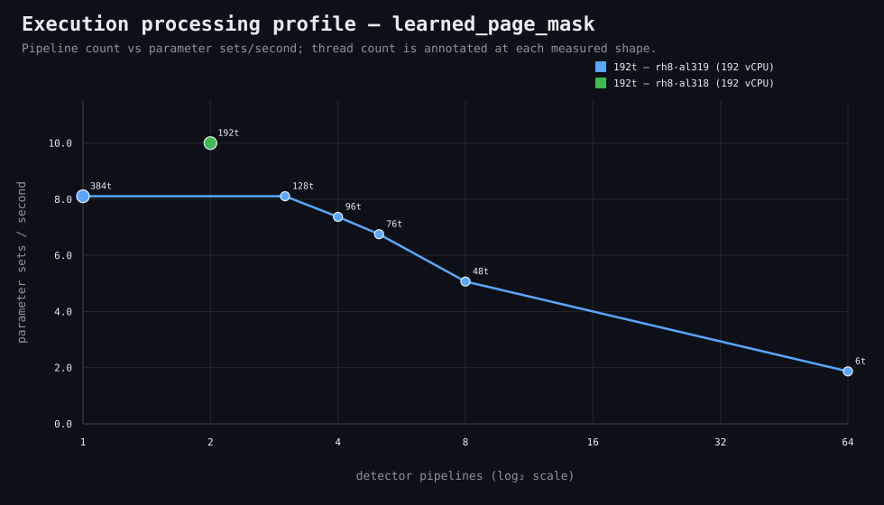

### Execution optimizer summary

Detector: `learned_page_mask`  
Optimizer run: **31662411413** — execution data below contains only shapes completed in this execution; the preferred configuration may use all compatible completed optimizer evidence.

<strong>Navigation</strong>

- [Preferred Detector Run Configuration](#preferred-detector-run-configuration)
- [Detector Run Profile Plot](#detector-run-profile-plot)
- [Detector Pipeline-Thread Shape Optimization Data](#detector-pipeline-thread-shape-optimization-data)

<strong>1. Preferred Detector Run Configuration</strong>

Compatible completed optimizer runs are coalesced by detector, workload, and concrete runner profile. Repeated shapes retain all observations; the preferred shape is selected canonically by throughput, then lower resource use for throughput-equivalent shapes.

| Detector | Runner | CPU | Physical | Logical | RAM | Preferred pipelines | Threads / pipeline | Preferred shape range (≤2%) | Search method | Optimization time | Allocated | Sets/s | Shape time | Observations |
|---|---|---|---:|---:|---:|---:|---:|---|---|---:|---:|---:|---:|---:|
| learned_page_mask | 192t — rh8-al318 (192 vCPU) | AMD EPYC 9655 96-Core Processor | 192 | 192 | 1511.3 GiB | 2 | 192 | 2p/192t | adaptive | 16m 42s | 384 | 9.99 | 16m 41s | 1 |
| learned_page_mask | 192t — rh8-al318 (192 vCPU) | AMD EPYC 9655 96-Core Processor | 192 | 192 | 1511.3 GiB | 4 | 96 | 3p/128t, 4p/96t | exhaustive | 1h 8m 59s | 384 | 10.28 | 16m 13s | 1 |
| learned_page_mask | 192t — rh8-al319 (192 vCPU) | AMD EPYC 9655 96-Core Processor | 192 | 192 | 1511.3 GiB | 1 | 384 | 1p/384t, 3p/128t | adaptive | 1m 2s | 384 | 8.10 | 30s | 2 |

**Search method legend:** `adaptive` = sparse wide-range search with local refinement around the measured peak and ≤2% preferred-shape boundaries; `powers-of-2` = logarithmic power-of-two pipeline sweep; `exhaustive` = every legal pipeline count in the requested range.

**Shape-prediction coverage:** vCPU anchors `192`; readiness **low**; prediction checks **0 verified / 0 pending**.
**Desired / missing optimization data:** missing: a second vCPU size to establish shape scaling.

[↑ Back to Navigation](#table-of-contents)

<strong>2. Detector Run Profile Plot</strong>

Compatible completed measurements are plotted as detector pipelines versus parameter sets/second; thread count is annotated at each measured shape.
**Search method:** `exhaustive`

[↑ Back to Navigation](#table-of-contents)

<strong>3. Detector Pipeline-Thread Shape Optimization Data</strong>

Shapes completed in this execution are shown below.

| Runner | Pipelines | Shards | Threads / pipeline | Allocated | Wall | Sets/s | Speedup | Δ from best | Avg load | Peak load | Avg CPU | Peak RAM |
|---|---:|---:|---:|---:|---:|---:|---:|---:|---:|---:|---:|---:|
| 192t — rh8-al318 (192 vCPU) | 1 | 1 | 384 | 384 | 19m 43s | 8.45 | 1.00× | -17.75% | 381.0 | 404.3 | 62.7% | 75.6 GiB |
| 192t — rh8-al318 (192 vCPU) | 2 | 2 | 192 | 384 | 16m 40s | 10.00 | 1.18× | -2.70% | 419.5 | 446.8 | 77.6% | 75.1 GiB |
| 192t — rh8-al318 (192 vCPU) | 3 | 3 | 128 | 384 | 16m 19s | 10.21 | 1.21× | -0.61% | 481.0 | 528.9 | 82.9% | 72.2 GiB |
| **192t — rh8-al318 (192 vCPU)** | 4 | 4 | 96 | 384 | 16m 13s | 10.28 | 1.22× | 0.00% | 523.1 | 578.0 | 87.2% | 73.5 GiB |

**Stop reason:** `shape_range_complete`

[↑ Back to Navigation](#table-of-contents)
