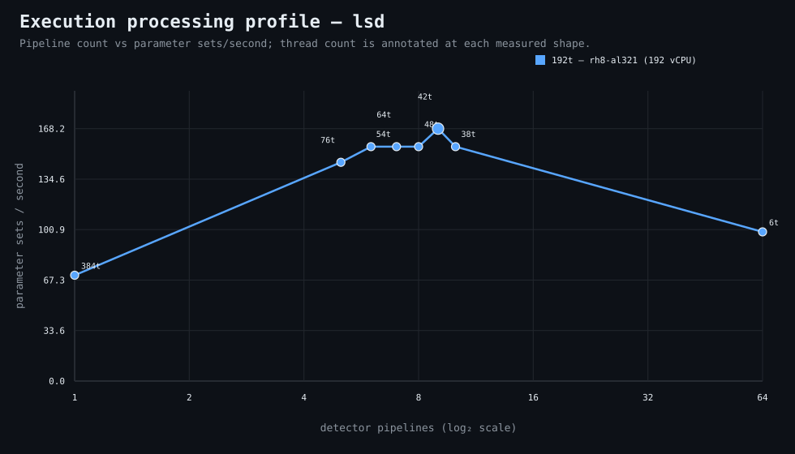

### Execution optimizer summary

Detector: `lsd`  
Optimizer run: **31337815528** — execution data below contains only shapes completed in this execution; the preferred configuration may use all compatible completed optimizer evidence.

<strong>Navigation</strong>

- [Preferred Detector Run Configuration](#preferred-detector-run-configuration)
- [Detector Run Profile Plot](#detector-run-profile-plot)
- [Detector Pipeline-Thread Shape Optimization Data](#detector-pipeline-thread-shape-optimization-data)

<strong>1. Preferred Detector Run Configuration</strong>

Compatible completed optimizer runs are coalesced by detector, workload, and concrete runner profile. Repeated shapes retain all observations; the preferred shape is selected canonically by throughput, then lower resource use for throughput-equivalent shapes.

| Detector | Runner | CPU | Physical | Logical | RAM | Preferred pipelines | Threads / pipeline | Preferred shape range (≤2%) | Search method | Optimization time | Allocated | Sets/s | Shape time | Observations |
|---|---|---|---:|---:|---:|---:|---:|---|---|---:|---:|---:|---:|---:|
| lsd | 192t — rh8-al321 (192 vCPU) | AMD EPYC 9655 96-Core Processor | 192 | 192 | 1511.3 GiB | 9 | 42 | 9p/42t | adaptive | 2m 19s | 378 | 168.23 | 13s | 1 |

[↑ Back to Navigation](#table-of-contents)

<strong>2. Detector Run Profile Plot</strong>

Compatible completed measurements are plotted as detector pipelines versus parameter sets/second; thread count is annotated at each measured shape.
**Search method:** `adaptive`

[↑ Back to Navigation](#table-of-contents)

<strong>3. Detector Pipeline-Thread Shape Optimization Data</strong>

Shapes completed in this execution are shown below.

| Runner | Pipelines | Shards | Threads / pipeline | Allocated | Wall | Sets/s | Speedup | Δ from best | Avg load | Peak load | Avg CPU | Peak RAM |
|---|---:|---:|---:|---:|---:|---:|---:|---:|---:|---:|---:|---:|
| 192t — rh8-al321 (192 vCPU) | 1 | 1 | 384 | 384 | 31s | 70.55 | 1.00× | -58.06% | — | — | — | — |
| 192t — rh8-al321 (192 vCPU) | 5 | 5 | 76 | 380 | 15s | 145.80 | 2.07× | -13.33% | — | — | — | — |
| 192t — rh8-al321 (192 vCPU) | 6 | 6 | 64 | 384 | 14s | 156.21 | 2.21× | -7.14% | — | — | — | — |
| 192t — rh8-al321 (192 vCPU) | 7 | 7 | 54 | 378 | 14s | 156.21 | 2.21× | -7.14% | — | — | — | — |
| 192t — rh8-al321 (192 vCPU) | 8 | 8 | 48 | 384 | 14s | 156.21 | 2.21× | -7.14% | 243.3 | 243.3 | 34.4% | 11.9 GiB |
| **192t — rh8-al321 (192 vCPU)** | 9 | 9 | 42 | 378 | 13s | 168.23 | 2.38× | 0.00% | 401.0 | 401.0 | 75.2% | 31.8 GiB |
| 192t — rh8-al321 (192 vCPU) | 10 | 10 | 38 | 380 | 14s | 156.21 | 2.21× | -7.14% | — | — | — | — |
| 192t — rh8-al321 (192 vCPU) | 64 | 64 | 6 | 384 | 22s | 99.41 | 1.41× | -40.91% | — | — | — | — |

**Stop reason:** `adaptive_search_complete`

[↑ Back to Navigation](#table-of-contents)
