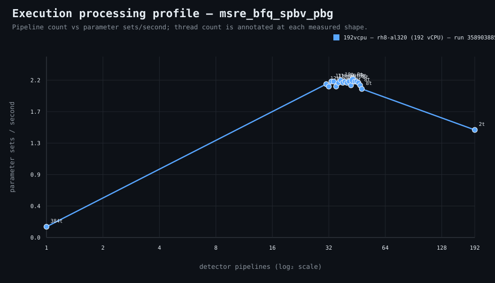

### Execution optimizer summary

Detector: `msre_bfq_spbv_pbg`  
Optimizer run: **31813031101** — execution data below contains only shapes completed in this execution; the preferred configuration may use all compatible completed optimizer evidence.

<strong>Navigation</strong>

- [Preferred Detector Run Configuration](#preferred-detector-run-configuration)
- [Detector Run Profile Plot](#detector-run-profile-plot)
- [Detector Pipeline-Thread Shape Optimization Data](#detector-pipeline-thread-shape-optimization-data)

<strong>1. Preferred Detector Run Configuration</strong>

Compatible completed optimizer runs are coalesced by detector, workload, and concrete runner profile. Repeated shapes retain all observations; the preferred shape is selected canonically by throughput, then lower resource use for throughput-equivalent shapes.

| Detector | Runner | CPU | Physical | Logical | RAM | Preferred pipelines | Threads / pipeline | Preferred shape range (≤2%) | Search method | Optimization time | Allocated | Sets/s | Shape time | Observations |
|---|---|---|---:|---:|---:|---:|---:|---|---|---:|---:|---:|---:|---:|
| msre_bfq_spbv_pbg | 192t — rh8-al318 (192 vCPU) | AMD EPYC 9655 96-Core Processor | 192 | 192 | 1511.3 GiB | 36 | 10 | 29p/13t, 30p/12t, 31p/12t, 32p/12t, 33p/11t, 34p/11t, 35p/10t, 36p/10t, 37p/10t, 38p/10t | adaptive | 1h 27m 24s | 360 | 11.10 | 3m 17s | 1 |

**Search method legend:** `adaptive` = sparse wide-range search with local refinement around the measured peak and ≤2% preferred-shape boundaries; `powers-of-2` = logarithmic power-of-two pipeline sweep; `exhaustive` = every legal pipeline count in the requested range.

**Shape-prediction coverage:** vCPU anchors `192`; readiness **low**; prediction checks **0 verified / 0 pending**.
**Desired / missing optimization data:** missing: a second vCPU size to establish shape scaling.

[↑ Back to Navigation](#table-of-contents)

<strong>2. Detector Run Profile Plot</strong>

Compatible completed measurements are plotted as detector pipelines versus parameter sets/second; thread count is annotated at each measured shape.
**Search method:** `adaptive`

[↑ Back to Navigation](#table-of-contents)

<strong>3. Detector Pipeline-Thread Shape Optimization Data</strong>

Shapes completed in this execution are shown below.

| Runner | Pipelines | Shards | Threads / pipeline | Allocated | Wall | Sets/s | Speedup | Δ from best | Avg load | Peak load | Avg CPU | Peak RAM |
|---|---:|---:|---:|---:|---:|---:|---:|---:|---:|---:|---:|---:|
| 192t — rh8-al318 (192 vCPU) | 2 | 2 | 192 | 384 | 38m 24s | 0.95 | — | -91.45% | 67.7 | 146.1 | 15.9% | 37.7 GiB |
| 192t — rh8-al318 (192 vCPU) | 14 | 14 | 27 | 378 | 5m 11s | 7.03 | — | -36.66% | 1096.9 | 1395.8 | 87.7% | 38.8 GiB |
| 192t — rh8-al318 (192 vCPU) | 28 | 28 | 13 | 364 | 3m 22s | 10.83 | — | -2.48% | 1399.0 | 1498.5 | 91.5% | 41.6 GiB |
| 192t — rh8-al318 (192 vCPU) | 29 | 29 | 13 | 377 | 3m 20s | 10.94 | — | -1.50% | 1547.8 | 1551.7 | 94.7% | 42.6 GiB |
| 192t — rh8-al318 (192 vCPU) | 30 | 30 | 12 | 360 | 3m 21s | 10.88 | — | -1.99% | 1500.9 | 1590.9 | 91.9% | 41.7 GiB |
| 192t — rh8-al318 (192 vCPU) | 31 | 31 | 12 | 372 | 3m 20s | 10.94 | — | -1.50% | 1676.5 | 1824.3 | 93.2% | 42.8 GiB |
| 192t — rh8-al318 (192 vCPU) | 32 | 32 | 12 | 384 | 3m 18s | 11.05 | — | -0.51% | 1591.1 | 1791.1 | 93.2% | 43.8 GiB |
| 192t — rh8-al318 (192 vCPU) | 33 | 33 | 11 | 363 | 3m 18s | 11.05 | — | -0.51% | 1554.2 | 1749.7 | 91.7% | 42.6 GiB |
| 192t — rh8-al318 (192 vCPU) | 34 | 34 | 11 | 374 | 3m 17s | 11.10 | — | 0.00% | 1687.5 | 1818.9 | 90.9% | 43.8 GiB |
| 192t — rh8-al318 (192 vCPU) | 35 | 35 | 10 | 350 | 3m 20s | 10.94 | — | -1.50% | 1712.5 | 1812.8 | 93.4% | 42.4 GiB |
| **192t — rh8-al318 (192 vCPU)** | 36 | 36 | 10 | 360 | 3m 17s | 11.10 | — | 0.00% | 1703.8 | 1827.7 | 91.2% | 43.3 GiB |
| 192t — rh8-al318 (192 vCPU) | 37 | 37 | 10 | 370 | 3m 20s | 10.94 | — | -1.50% | 1657.9 | 1874.3 | 92.3% | 44.4 GiB |
| 192t — rh8-al318 (192 vCPU) | 38 | 38 | 10 | 380 | 3m 19s | 10.99 | — | -1.01% | 1730.3 | 1921.0 | 91.4% | 45.5 GiB |
| 192t — rh8-al318 (192 vCPU) | 39 | 39 | 9 | 351 | 3m 23s | 10.77 | — | -2.96% | 1733.6 | 1948.3 | 93.6% | 43.7 GiB |
| 192t — rh8-al318 (192 vCPU) | 96 | 96 | 4 | 384 | 3m 48s | 9.59 | — | -13.60% | 2774.1 | 3885.8 | 80.6% | 60.2 GiB |

**Early stop:** throughput plateau detected after 3 consecutive completed shapes improved by less than 2.0% from the perceived maximum.

[↑ Back to Navigation](#table-of-contents)
