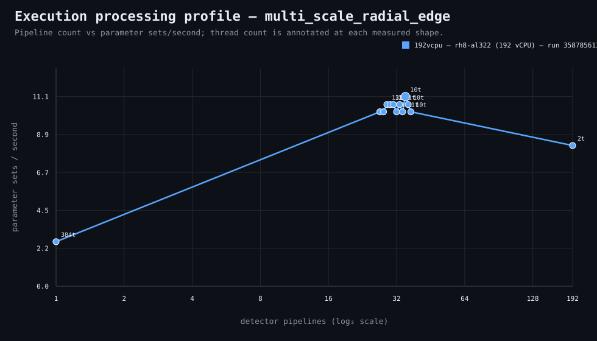

### Execution optimizer summary

Detector: `multi_scale_radial_edge`  
Optimizer run: **33207798869** — execution data below contains only shapes completed in this execution; the preferred configuration may use all compatible completed optimizer evidence.

<strong>Navigation</strong>

- [Preferred Detector Run Configuration](#preferred-detector-run-configuration)
- [Detector Run Profile Plot](#detector-run-profile-plot)
- [Detector Pipeline-Thread Shape Optimization Data](#detector-pipeline-thread-shape-optimization-data)

<strong>1. Preferred Detector Run Configuration</strong>

Compatible completed optimizer runs are coalesced by detector, workload, and concrete runner profile. Repeated shapes retain all observations; the preferred shape is selected canonically by throughput, then newest compatible optimizer run, then lower resource use within a run.

| Detector | Runner | CPU | Physical | Logical | RAM | Preferred pipelines | Threads / pipeline | Preferred shape range (≤2%) | Search method | Optimization time | Allocated | Sets/s | Shape time | Observations |
|---|---|---|---:|---:|---:|---:|---:|---|---|---:|---:|---:|---:|---:|
| multi_scale_radial_edge | 192t — rh8-al316 (192 vCPU) | AMD EPYC 9655 96-Core Processor | 192 | 192 | 2897.3 GiB | 30 | 12 | 10p/38t, 11p/34t, 12p/32t, 13p/29t, 14p/27t, 15p/25t, 16p/24t, 17p/22t, 18p/21t, 19p/20t, 20p/19t, 21p/18t, 22p/17t, 23p/16t, 24p/16t, 25p/15t, 26p/14t, 27p/14t, 28p/13t, 29p/13t, 30p/12t, 31p/12t, 32p/12t, 33p/11t | legacy | 2m 58s | 360 | 42.67 | 6s | 28 |

**Search method legend:** `adaptive` = sparse wide-range search with local refinement around the measured peak and ≤2% preferred-shape boundaries; `powers-of-2` = logarithmic power-of-two pipeline sweep; `exhaustive` = every legal pipeline count in the requested range.

**Shape-prediction coverage:** vCPU anchors `192`; readiness **low**; prediction checks **0 verified / 0 pending**.
**Desired / missing optimization data:** missing: a second vCPU size to establish shape scaling.

[↑ Back to Navigation](#table-of-contents)

<strong>2. Detector Run Profile Plot</strong>

Compatible completed measurements are plotted as detector pipelines versus parameter sets/second; thread count is annotated at each measured shape.
**Search method:** `adaptive`

[↑ Back to Navigation](#table-of-contents)

<strong>3. Detector Pipeline-Thread Shape Optimization Data</strong>

Shapes completed in this execution are shown below.

This table contains measurements from this optimizer execution only. Bold identifies this run’s measured throughput winner; the preferred configuration above is selected from all compatible coalesced optimizer evidence.

| Runner | Pipelines | Shards | Threads / pipeline | Allocated | Wall | Startup overhead | Sets/s | Speedup | Δ from run best | Avg load | Peak load | Avg CPU | Peak RAM |
|---|---:|---:|---:|---:|---:|---:|---:|---:|---:|---:|---:|---:|---:|
| 192t — rh8-al316 (192 vCPU) | 2 | 2 | 192 | 384 | 13s | 0s | 19.69 | — | -53.85% | — | — | — | — |
| 192t — rh8-al316 (192 vCPU) | 9 | 9 | 42 | 378 | 7s | 1s | 36.57 | — | -14.29% | — | — | — | — |
| 192t — rh8-al316 (192 vCPU) | 10 | 10 | 38 | 380 | 6s | 1s | 42.67 | — | 0.00% | — | — | — | — |
| 192t — rh8-al316 (192 vCPU) | 11 | 11 | 34 | 374 | 6s | 1s | 42.67 | — | 0.00% | — | — | — | — |
| 192t — rh8-al316 (192 vCPU) | 12 | 12 | 32 | 384 | 6s | 1s | 42.67 | — | 0.00% | — | — | — | — |
| 192t — rh8-al316 (192 vCPU) | 13 | 13 | 29 | 377 | 6s | 1s | 42.67 | — | 0.00% | — | — | — | — |
| 192t — rh8-al316 (192 vCPU) | 14 | 14 | 27 | 378 | 6s | 1s | 42.67 | — | 0.00% | — | — | — | — |
| 192t — rh8-al316 (192 vCPU) | 15 | 15 | 25 | 375 | 6s | 1s | 42.67 | — | 0.00% | 240.7 | 240.7 | 36.1% | 16.7 GiB |
| 192t — rh8-al316 (192 vCPU) | 16 | 16 | 24 | 384 | 6s | 1s | 42.67 | — | 0.00% | — | — | — | — |
| 192t — rh8-al316 (192 vCPU) | 17 | 17 | 22 | 374 | 6s | 1s | 42.67 | — | 0.00% | — | — | — | — |
| 192t — rh8-al316 (192 vCPU) | 18 | 18 | 21 | 378 | 6s | 1s | 42.67 | — | 0.00% | — | — | — | — |
| 192t — rh8-al316 (192 vCPU) | 19 | 19 | 20 | 380 | 6s | 1s | 42.67 | — | 0.00% | — | — | — | — |
| 192t — rh8-al316 (192 vCPU) | 20 | 20 | 19 | 380 | 6s | 1s | 42.67 | — | 0.00% | — | — | — | — |
| 192t — rh8-al316 (192 vCPU) | 21 | 21 | 18 | 378 | 6s | 1s | 42.67 | — | 0.00% | — | — | — | — |
| 192t — rh8-al316 (192 vCPU) | 22 | 22 | 17 | 374 | 6s | 1s | 42.67 | — | 0.00% | — | — | — | — |
| 192t — rh8-al316 (192 vCPU) | 23 | 23 | 16 | 368 | 6s | 1s | 42.67 | — | 0.00% | 447.3 | 447.3 | 48.1% | 18.9 GiB |
| 192t — rh8-al316 (192 vCPU) | 24 | 24 | 16 | 384 | 6s | 1s | 42.67 | — | 0.00% | — | — | — | — |
| 192t — rh8-al316 (192 vCPU) | 25 | 25 | 15 | 375 | 6s | 1s | 42.67 | — | 0.00% | — | — | — | — |
| 192t — rh8-al316 (192 vCPU) | 26 | 26 | 14 | 364 | 6s | 1s | 42.67 | — | 0.00% | — | — | — | — |
| 192t — rh8-al316 (192 vCPU) | 27 | 27 | 14 | 378 | 6s | 1s | 42.67 | — | 0.00% | — | — | — | — |
| 192t — rh8-al316 (192 vCPU) | 28 | 28 | 13 | 364 | 6s | 1s | 42.67 | — | 0.00% | — | — | — | — |
| 192t — rh8-al316 (192 vCPU) | 29 | 29 | 13 | 377 | 6s | 1s | 42.67 | — | 0.00% | — | — | — | — |
| **192t — rh8-al316 (192 vCPU)** | 30 | 30 | 12 | 360 | 6s | 1s | 42.67 | — | 0.00% | — | — | — | — |
| 192t — rh8-al316 (192 vCPU) | 31 | 31 | 12 | 372 | 6s | 1s | 42.67 | — | 0.00% | — | — | — | — |
| 192t — rh8-al316 (192 vCPU) | 32 | 32 | 12 | 384 | 6s | 1s | 42.67 | — | 0.00% | 636.7 | 636.7 | 51.1% | 35.4 GiB |
| 192t — rh8-al316 (192 vCPU) | 33 | 33 | 11 | 363 | 6s | 1s | 42.67 | — | 0.00% | — | — | — | — |
| 192t — rh8-al316 (192 vCPU) | 34 | 34 | 11 | 374 | 7s | 1s | 36.57 | — | -14.29% | — | — | — | — |
| 192t — rh8-al316 (192 vCPU) | 62 | 62 | 6 | 372 | 7s | 1s | 36.57 | — | -14.29% | — | — | — | — |

**Startup-overhead note:** executor startup is measured from `run-detector-regressions` entry through detector lifecycle preparation, planning, shared learned-evidence resolution/preparation, and initial queue setup before pipeline fan-out. It remains included in **Wall** and therefore in shape-level **Sets/s** as a constant reminder of incurred end-to-end cost. Per-shard parameter-set throughput is timed after fan-out and does not include this pre-fan-out startup overhead.

**Early stop:** perceived throughput peak/plateau bracketed by completed shapes more than 2.0% below the peak on both available sides.

[↑ Back to Navigation](#table-of-contents)
