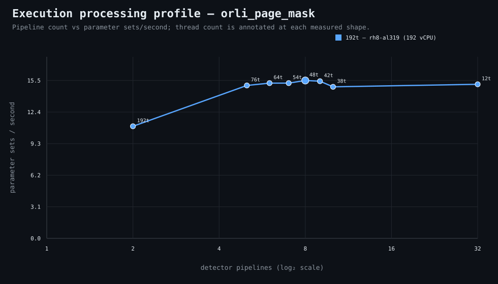

### Execution optimizer summary

Detector: `orli_page_mask`  
Optimizer run: **32085960414** — execution data below contains only shapes completed in this execution; the preferred configuration may use all compatible completed optimizer evidence.

<strong>Navigation</strong>

- [Preferred Detector Run Configuration](#preferred-detector-run-configuration)
- [Detector Run Profile Plot](#detector-run-profile-plot)
- [Detector Pipeline-Thread Shape Optimization Data](#detector-pipeline-thread-shape-optimization-data)

<strong>1. Preferred Detector Run Configuration</strong>

Compatible completed optimizer runs are coalesced by detector, workload, and concrete runner profile. Repeated shapes retain all observations; the preferred shape is selected canonically by throughput, then lower resource use for throughput-equivalent shapes.

| Detector | Runner | CPU | Physical | Logical | RAM | Preferred pipelines | Threads / pipeline | Preferred shape range (≤2%) | Search method | Optimization time | Allocated | Sets/s | Shape time | Observations |
|---|---|---|---:|---:|---:|---:|---:|---|---|---:|---:|---:|---:|---:|
| orli_page_mask | 192t — rh8-al319 (192 vCPU) | AMD EPYC 9655 96-Core Processor | 192 | 192 | 1511.3 GiB | 8 | 48 | 6p/64t, 7p/54t, 8p/48t, 9p/42t | legacy | 1h 31m 44s | 384 | 15.53 | 10m 44s | 1 |

**Search method legend:** `adaptive` = sparse wide-range search with local refinement around the measured peak and ≤2% preferred-shape boundaries; `powers-of-2` = logarithmic power-of-two pipeline sweep; `exhaustive` = every legal pipeline count in the requested range.

**Shape-prediction coverage:** vCPU anchors `192`; readiness **low**; prediction checks **0 verified / 0 pending**.
**Desired / missing optimization data:** missing: a second vCPU size to establish shape scaling.

[↑ Back to Navigation](#table-of-contents)

<strong>2. Detector Run Profile Plot</strong>

Compatible completed measurements are plotted as detector pipelines versus parameter sets/second; thread count is annotated at each measured shape.
**Search method:** `adaptive`

[↑ Back to Navigation](#table-of-contents)

<strong>3. Detector Pipeline-Thread Shape Optimization Data</strong>

Shapes completed in this execution are shown below.

This table contains measurements from this optimizer execution only. Bold identifies this run’s measured throughput winner; the preferred configuration above is selected from all compatible coalesced optimizer evidence.

| Runner | Pipelines | Shards | Threads / pipeline | Allocated | Wall | Sets/s | Speedup | Δ from run best | Avg load | Peak load | Avg CPU | Peak RAM |
|---|---:|---:|---:|---:|---:|---:|---:|---:|---:|---:|---:|---:|
| 192t — rh8-al319 (192 vCPU) | 2 | 2 | 192 | 384 | 15m 7s | 11.03 | — | -29.00% | 132.1 | 193.0 | 70.6% | 18.1 GiB |
| 192t — rh8-al319 (192 vCPU) | 5 | 5 | 76 | 380 | 11m 5s | 15.04 | — | -3.16% | 181.9 | 192.9 | 94.4% | 17.7 GiB |
| 192t — rh8-al319 (192 vCPU) | 6 | 6 | 64 | 384 | 10m 55s | 15.27 | — | -1.68% | 179.6 | 192.1 | 93.3% | 18.0 GiB |
| 192t — rh8-al319 (192 vCPU) | 7 | 7 | 54 | 378 | 10m 55s | 15.27 | — | -1.68% | 179.7 | 192.6 | 94.1% | 17.6 GiB |
| **192t — rh8-al319 (192 vCPU)** | 8 | 8 | 48 | 384 | 10m 44s | 15.53 | — | 0.00% | 186.0 | 192.3 | 96.1% | 18.0 GiB |
| 192t — rh8-al319 (192 vCPU) | 9 | 9 | 42 | 378 | 10m 47s | 15.46 | — | -0.46% | 180.4 | 193.4 | 93.6% | 18.0 GiB |
| 192t — rh8-al319 (192 vCPU) | 10 | 10 | 38 | 380 | 11m 11s | 14.90 | — | -4.02% | 184.1 | 193.1 | 94.0% | 17.7 GiB |
| 192t — rh8-al319 (192 vCPU) | 32 | 32 | 12 | 384 | 11m | 15.15 | — | -2.42% | 181.9 | 200.1 | 93.9% | 18.0 GiB |

**Early stop:** throughput plateau detected after 3 consecutive completed shapes improved by less than 2.0% from the perceived maximum.

[↑ Back to Navigation](#table-of-contents)
