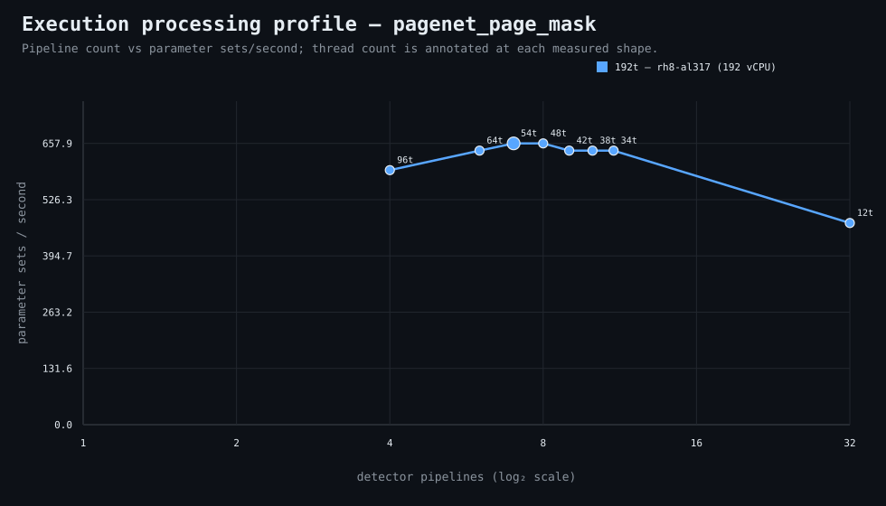

### Execution optimizer summary

Detector: `pagenet_page_mask`  
Optimizer run: **32437944274** — execution data below contains only shapes completed in this execution; the preferred configuration may use all compatible completed optimizer evidence.

<strong>Navigation</strong>

- [Preferred Detector Run Configuration](#preferred-detector-run-configuration)
- [Detector Run Profile Plot](#detector-run-profile-plot)
- [Detector Pipeline-Thread Shape Optimization Data](#detector-pipeline-thread-shape-optimization-data)

<strong>1. Preferred Detector Run Configuration</strong>

Compatible completed optimizer runs are coalesced by detector, workload, and concrete runner profile. Repeated shapes retain all observations; the preferred shape is selected canonically by throughput, then lower resource use for throughput-equivalent shapes.

| Detector | Runner | CPU | Physical | Logical | RAM | Preferred pipelines | Threads / pipeline | Preferred shape range (≤2%) | Search method | Optimization time | Allocated | Sets/s | Shape time | Observations |
|---|---|---|---:|---:|---:|---:|---:|---|---|---:|---:|---:|---:|---:|
| pagenet_page_mask | 192t — rh8-al317 (192 vCPU) | AMD EPYC 9655 96-Core Processor | 192 | 192 | 3023.3 GiB | 7 | 54 | 7p/54t, 8p/48t | legacy | 5m 27s | 378 | 657.89 | 38s | 1 |

**Search method legend:** `adaptive` = sparse wide-range search with local refinement around the measured peak and ≤2% preferred-shape boundaries; `powers-of-2` = logarithmic power-of-two pipeline sweep; `exhaustive` = every legal pipeline count in the requested range.

**Shape-prediction coverage:** vCPU anchors `192`; readiness **low**; prediction checks **0 verified / 0 pending**.
**Desired / missing optimization data:** missing: a second vCPU size to establish shape scaling.

[↑ Back to Navigation](#table-of-contents)

<strong>2. Detector Run Profile Plot</strong>

Compatible completed measurements are plotted as detector pipelines versus parameter sets/second; thread count is annotated at each measured shape.
**Search method:** `adaptive`

[↑ Back to Navigation](#table-of-contents)

<strong>3. Detector Pipeline-Thread Shape Optimization Data</strong>

Shapes completed in this execution are shown below.

This table contains measurements from this optimizer execution only. Bold identifies this run’s measured throughput winner; the preferred configuration above is selected from all compatible coalesced optimizer evidence.

| Runner | Pipelines | Shards | Threads / pipeline | Allocated | Wall | Startup overhead | Sets/s | Speedup | Δ from run best | Avg load | Peak load | Avg CPU | Peak RAM |
|---|---:|---:|---:|---:|---:|---:|---:|---:|---:|---:|---:|---:|---:|
| 192t — rh8-al317 (192 vCPU) | 4 | 4 | 96 | 384 | 42s | 2s | 595.24 | — | -9.52% | — | — | — | — |
| 192t — rh8-al317 (192 vCPU) | 6 | 6 | 64 | 384 | 39s | 2s | 641.03 | — | -2.56% | — | — | — | — |
| **192t — rh8-al317 (192 vCPU)** | 7 | 7 | 54 | 378 | 38s | 2s | 657.89 | — | 0.00% | — | — | — | — |
| 192t — rh8-al317 (192 vCPU) | 8 | 8 | 48 | 384 | 38s | 2s | 657.89 | — | 0.00% | 21.0 | 21.0 | 13.6% | 16.8 GiB |
| 192t — rh8-al317 (192 vCPU) | 9 | 9 | 42 | 378 | 39s | 2s | 641.03 | — | -2.56% | — | — | — | — |
| 192t — rh8-al317 (192 vCPU) | 10 | 10 | 38 | 380 | 39s | 2s | 641.03 | — | -2.56% | 19.3 | 19.3 | 7.5% | 17.1 GiB |
| 192t — rh8-al317 (192 vCPU) | 11 | 11 | 34 | 374 | 39s | 2s | 641.03 | — | -2.56% | 14.2 | 14.2 | 7.7% | 16.9 GiB |
| 192t — rh8-al317 (192 vCPU) | 32 | 32 | 12 | 384 | 53s | 3s | 471.70 | — | -28.30% | 16.6 | 16.6 | 16.6% | 17.3 GiB |

**Startup-overhead note:** executor startup is measured from `run-detector-regressions` entry through detector lifecycle preparation, planning, shared learned-evidence resolution/preparation, and initial queue setup before pipeline fan-out. It remains included in **Wall** and therefore in shape-level **Sets/s** as a constant reminder of incurred end-to-end cost. Per-shard parameter-set throughput is timed after fan-out and does not include this pre-fan-out startup overhead.

**Stop reason:** `adaptive_search_complete`

[↑ Back to Navigation](#table-of-contents)
