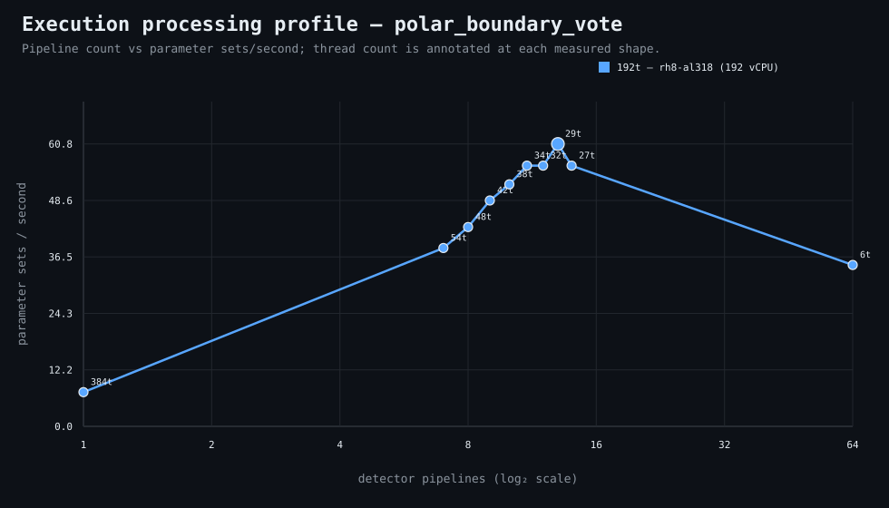

### Execution optimizer summary

Detector: `polar_boundary_vote`  
Optimizer run: **31613956281** — execution data below contains only shapes completed in this execution; the preferred configuration may use all compatible completed optimizer evidence.

<strong>Navigation</strong>

- [Preferred Detector Run Configuration](#preferred-detector-run-configuration)
- [Detector Run Profile Plot](#detector-run-profile-plot)
- [Detector Pipeline-Thread Shape Optimization Data](#detector-pipeline-thread-shape-optimization-data)

<strong>1. Preferred Detector Run Configuration</strong>

Compatible completed optimizer runs are coalesced by detector, workload, and concrete runner profile. Repeated shapes retain all observations; the preferred shape is selected canonically by throughput, then lower resource use for throughput-equivalent shapes.

| Detector | Runner | CPU | Physical | Logical | RAM | Preferred pipelines | Threads / pipeline | Preferred shape range (≤2%) | Search method | Optimization time | Allocated | Sets/s | Shape time | Observations |
|---|---|---|---:|---:|---:|---:|---:|---|---|---:|---:|---:|---:|---:|
| polar_boundary_vote | 192t — rh8-al318 (192 vCPU) | AMD EPYC 9655 96-Core Processor | 192 | 192 | 1511.3 GiB | 13 | 29 | 13p/29t | adaptive | 4m 2s | 377 | 60.75 | 12s | 1 |

**Search method legend:** `adaptive` = sparse wide-range search with local refinement around the measured peak and ≤2% preferred-shape boundaries; `powers-of-2` = logarithmic power-of-two pipeline sweep; `exhaustive` = every legal pipeline count in the requested range.

**Shape-prediction coverage:** vCPU anchors `192`; readiness **low**; prediction checks **0 verified / 0 pending**.
**Desired / missing optimization data:** missing: a second vCPU size to establish shape scaling.

[↑ Back to Navigation](#table-of-contents)

<strong>2. Detector Run Profile Plot</strong>

Compatible completed measurements are plotted as detector pipelines versus parameter sets/second; thread count is annotated at each measured shape.
**Search method:** `adaptive`

[↑ Back to Navigation](#table-of-contents)

<strong>3. Detector Pipeline-Thread Shape Optimization Data</strong>

Shapes completed in this execution are shown below.

| Runner | Pipelines | Shards | Threads / pipeline | Allocated | Wall | Sets/s | Speedup | Δ from best | Avg load | Peak load | Avg CPU | Peak RAM |
|---|---:|---:|---:|---:|---:|---:|---:|---:|---:|---:|---:|---:|
| 192t — rh8-al318 (192 vCPU) | 1 | 1 | 384 | 384 | 1m 39s | 7.36 | 1.00× | -87.88% | 0.9 | 0.9 | 0.9% | 19.1 GiB |
| 192t — rh8-al318 (192 vCPU) | 7 | 7 | 54 | 378 | 19s | 38.37 | 5.21× | -36.84% | — | — | — | — |
| 192t — rh8-al318 (192 vCPU) | 8 | 8 | 48 | 384 | 17s | 42.88 | 5.82× | -29.41% | — | — | — | — |
| 192t — rh8-al318 (192 vCPU) | 9 | 9 | 42 | 378 | 15s | 48.60 | 6.60× | -20.00% | — | — | — | — |
| 192t — rh8-al318 (192 vCPU) | 10 | 10 | 38 | 380 | 14s | 52.07 | 7.07× | -14.29% | 77.7 | 77.7 | 8.1% | 18.4 GiB |
| 192t — rh8-al318 (192 vCPU) | 11 | 11 | 34 | 374 | 13s | 56.08 | 7.62× | -7.69% | — | — | — | — |
| 192t — rh8-al318 (192 vCPU) | 12 | 12 | 32 | 384 | 13s | 56.08 | 7.62× | -7.69% | — | — | — | — |
| **192t — rh8-al318 (192 vCPU)** | 13 | 13 | 29 | 377 | 12s | 60.75 | 8.25× | 0.00% | — | — | — | — |
| 192t — rh8-al318 (192 vCPU) | 14 | 14 | 27 | 378 | 13s | 56.08 | 7.62× | -7.69% | 175.2 | 175.2 | 11.2% | 20.4 GiB |
| 192t — rh8-al318 (192 vCPU) | 64 | 64 | 6 | 384 | 21s | 34.71 | 4.71× | -42.86% | 196.0 | 196.0 | 6.1% | 11.2 GiB |

**Stop reason:** `adaptive_search_complete`

[↑ Back to Navigation](#table-of-contents)
