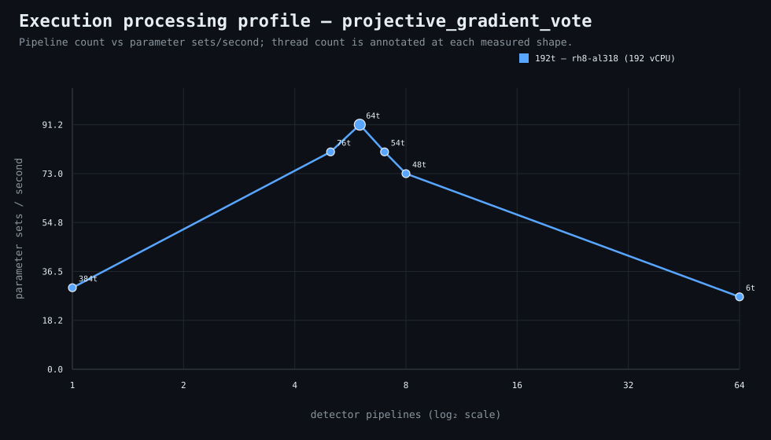

### Execution optimizer summary

Detector: `projective_gradient_vote`  
Optimizer run: **31714523594** — execution data below contains only shapes completed in this execution; the preferred configuration may use all compatible completed optimizer evidence.

<strong>Navigation</strong>

- [Preferred Detector Run Configuration](#preferred-detector-run-configuration)
- [Detector Run Profile Plot](#detector-run-profile-plot)
- [Detector Pipeline-Thread Shape Optimization Data](#detector-pipeline-thread-shape-optimization-data)

<strong>1. Preferred Detector Run Configuration</strong>

Compatible completed optimizer runs are coalesced by detector, workload, and concrete runner profile. Repeated shapes retain all observations; the preferred shape is selected canonically by throughput, then lower resource use for throughput-equivalent shapes.

| Detector | Runner | CPU | Physical | Logical | RAM | Preferred pipelines | Threads / pipeline | Preferred shape range (≤2%) | Search method | Optimization time | Allocated | Sets/s | Shape time | Observations |
|---|---|---|---:|---:|---:|---:|---:|---|---|---:|---:|---:|---:|---:|
| projective_gradient_vote | 192t — rh8-al318 (192 vCPU) | AMD EPYC 9655 96-Core Processor | 192 | 192 | 1511.3 GiB | 6 | 64 | 6p/64t | adaptive | 1m 31s | 384 | 91.25 | 8s | 1 |

**Search method legend:** `adaptive` = sparse wide-range search with local refinement around the measured peak and ≤2% preferred-shape boundaries; `powers-of-2` = logarithmic power-of-two pipeline sweep; `exhaustive` = every legal pipeline count in the requested range.

**Shape-prediction coverage:** vCPU anchors `192`; readiness **low**; prediction checks **0 verified / 0 pending**.
**Desired / missing optimization data:** missing: a second vCPU size to establish shape scaling.

[↑ Back to Navigation](#table-of-contents)

<strong>2. Detector Run Profile Plot</strong>

Compatible completed measurements are plotted as detector pipelines versus parameter sets/second; thread count is annotated at each measured shape.
**Search method:** `adaptive`

[↑ Back to Navigation](#table-of-contents)

<strong>3. Detector Pipeline-Thread Shape Optimization Data</strong>

Shapes completed in this execution are shown below.

| Runner | Pipelines | Shards | Threads / pipeline | Allocated | Wall | Sets/s | Speedup | Δ from best | Avg load | Peak load | Avg CPU | Peak RAM |
|---|---:|---:|---:|---:|---:|---:|---:|---:|---:|---:|---:|---:|
| 192t — rh8-al318 (192 vCPU) | 1 | 1 | 384 | 384 | 24s | 30.42 | 1.00× | -66.67% | — | — | — | — |
| 192t — rh8-al318 (192 vCPU) | 5 | 5 | 76 | 380 | 9s | 81.11 | 2.67× | -11.11% | — | — | — | — |
| **192t — rh8-al318 (192 vCPU)** | 6 | 6 | 64 | 384 | 8s | 91.25 | 3.00× | 0.00% | — | — | — | — |
| 192t — rh8-al318 (192 vCPU) | 7 | 7 | 54 | 378 | 9s | 81.11 | 2.67× | -11.11% | — | — | — | — |
| 192t — rh8-al318 (192 vCPU) | 8 | 8 | 48 | 384 | 10s | 73.00 | 2.40× | -20.00% | 256.9 | 256.9 | 17.4% | 25.0 GiB |
| 192t — rh8-al318 (192 vCPU) | 64 | 64 | 6 | 384 | 27s | 27.04 | 0.89× | -70.37% | — | — | — | — |

**Stop reason:** `adaptive_search_complete`

[↑ Back to Navigation](#table-of-contents)
