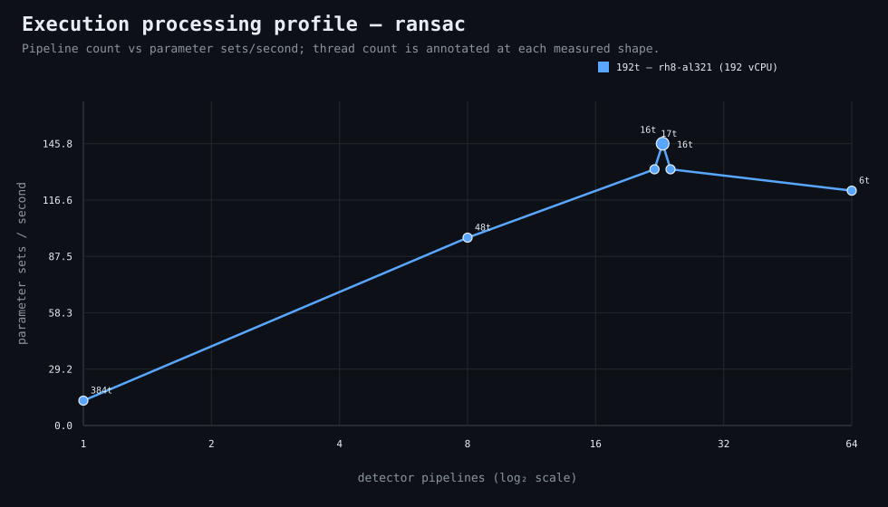

### Execution optimizer summary

Detector: `ransac`  
Optimizer run: **31337400373** — execution data below contains only shapes completed in this execution; the preferred configuration may use all compatible completed optimizer evidence.

<strong>Navigation</strong>

- [Preferred Detector Run Configuration](#preferred-detector-run-configuration)
- [Detector Run Profile Plot](#detector-run-profile-plot)
- [Detector Pipeline-Thread Shape Optimization Data](#detector-pipeline-thread-shape-optimization-data)

<strong>1. Preferred Detector Run Configuration</strong>

Compatible completed optimizer runs are coalesced by detector, workload, and concrete runner profile. Repeated shapes retain all observations; the preferred shape is selected canonically by throughput, then lower resource use for throughput-equivalent shapes.

| Detector | Runner | CPU | Physical | Logical | RAM | Preferred pipelines | Threads / pipeline | Preferred shape range (≤2%) | Search method | Optimization time | Allocated | Sets/s | Shape time | Observations |
|---|---|---|---:|---:|---:|---:|---:|---|---|---:|---:|---:|---:|---:|
| ransac | 192t — rh8-al321 (192 vCPU) | AMD EPYC 9655 96-Core Processor | 192 | 192 | 1511.3 GiB | 23 | 16 | 23p/16t | adaptive | 2m 54s | 368 | 145.80 | 10s | 1 |

[↑ Back to Navigation](#table-of-contents)

<strong>2. Detector Run Profile Plot</strong>

Compatible completed measurements are plotted as detector pipelines versus parameter sets/second; thread count is annotated at each measured shape.
**Search method:** `adaptive`

[↑ Back to Navigation](#table-of-contents)

<strong>3. Detector Pipeline-Thread Shape Optimization Data</strong>

Shapes completed in this execution are shown below.

| Runner | Pipelines | Shards | Threads / pipeline | Allocated | Wall | Sets/s | Speedup | Δ from best | Avg load | Peak load | Avg CPU | Peak RAM |
|---|---:|---:|---:|---:|---:|---:|---:|---:|---:|---:|---:|---:|
| 192t — rh8-al321 (192 vCPU) | 1 | 1 | 384 | 384 | 1m 53s | 12.90 | 1.00× | -91.15% | 1.2 | 1.2 | 0.8% | 11.8 GiB |
| 192t — rh8-al321 (192 vCPU) | 8 | 8 | 48 | 384 | 15s | 97.20 | 7.53× | -33.33% | — | — | — | — |
| 192t — rh8-al321 (192 vCPU) | 22 | 22 | 17 | 374 | 11s | 132.55 | 10.27× | -9.09% | — | — | — | — |
| **192t — rh8-al321 (192 vCPU)** | 23 | 23 | 16 | 368 | 10s | 145.80 | 11.30× | 0.00% | — | — | — | — |
| 192t — rh8-al321 (192 vCPU) | 24 | 24 | 16 | 384 | 11s | 132.55 | 10.27× | -9.09% | — | — | — | — |
| 192t — rh8-al321 (192 vCPU) | 64 | 64 | 6 | 384 | 12s | 121.50 | 9.42× | -16.67% | 1.3 | 1.3 | 0.7% | 11.0 GiB |

**Stop reason:** `adaptive_search_complete`

[↑ Back to Navigation](#table-of-contents)
