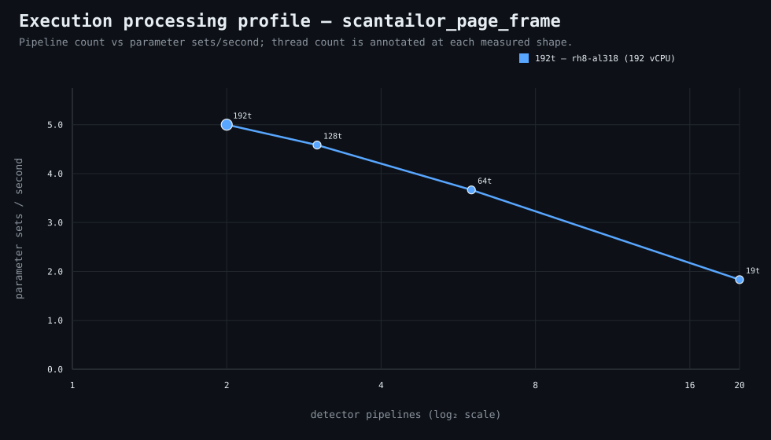

### Execution optimizer summary

Detector: `scantailor_page_frame`  
Optimizer run: **32531925569** — execution data below contains only shapes completed in this execution; the preferred configuration may use all compatible completed optimizer evidence.

<strong>Navigation</strong>

- [Preferred Detector Run Configuration](#preferred-detector-run-configuration)
- [Detector Run Profile Plot](#detector-run-profile-plot)
- [Detector Pipeline-Thread Shape Optimization Data](#detector-pipeline-thread-shape-optimization-data)

<strong>1. Preferred Detector Run Configuration</strong>

Compatible completed optimizer runs are coalesced by detector, workload, and concrete runner profile. Repeated shapes retain all observations; the preferred shape is selected canonically by throughput, then lower resource use for throughput-equivalent shapes.

| Detector | Runner | CPU | Physical | Logical | RAM | Preferred pipelines | Threads / pipeline | Preferred shape range (≤2%) | Search method | Optimization time | Allocated | Sets/s | Shape time | Observations |
|---|---|---|---:|---:|---:|---:|---:|---|---|---:|---:|---:|---:|---:|
| scantailor_page_frame | 192t — rh8-al307 (192 vCPU) | AMD EPYC 9655 96-Core Processor | 192 | 192 | 6047.3 GiB | 10 | 38 | 9p/42t, 10p/38t | legacy | 19m 52s | 380 | 27.43 | 1m 24s | 1 |

**Search method legend:** `adaptive` = sparse wide-range search with local refinement around the measured peak and ≤2% preferred-shape boundaries; `powers-of-2` = logarithmic power-of-two pipeline sweep; `exhaustive` = every legal pipeline count in the requested range.

**Shape-prediction coverage:** vCPU anchors `192`; readiness **low**; prediction checks **0 verified / 0 pending**.
**Desired / missing optimization data:** missing: a second vCPU size to establish shape scaling.

[↑ Back to Navigation](#table-of-contents)

<strong>2. Detector Run Profile Plot</strong>

Compatible completed measurements are plotted as detector pipelines versus parameter sets/second; thread count is annotated at each measured shape.
**Search method:** `adaptive`

[↑ Back to Navigation](#table-of-contents)

<strong>3. Detector Pipeline-Thread Shape Optimization Data</strong>

Shapes completed in this execution are shown below.

This table contains measurements from this optimizer execution only. Bold identifies this run’s measured throughput winner; the preferred configuration above is selected from all compatible coalesced optimizer evidence.

| Runner | Pipelines | Shards | Threads / pipeline | Allocated | Wall | Startup overhead | Sets/s | Speedup | Δ from run best | Avg load | Peak load | Avg CPU | Peak RAM |
|---|---:|---:|---:|---:|---:|---:|---:|---:|---:|---:|---:|---:|---:|
| 192t — rh8-al307 (192 vCPU) | 1 | 1 | 96 | 96 | 2m 22s | 0s | 16.23 | 1.00× | -40.85% | 94.5 | 114.9 | 58.3% | 28.4 GiB |
| 192t — rh8-al307 (192 vCPU) | 8 | 8 | 48 | 384 | 1m 31s | 0s | 25.32 | 1.56× | -7.69% | 814.7 | 825.6 | 87.8% | 41.3 GiB |
| 192t — rh8-al307 (192 vCPU) | 9 | 9 | 42 | 378 | 1m 25s | 0s | 27.11 | 1.67× | -1.18% | 927.8 | 927.8 | 91.1% | 42.5 GiB |
| **192t — rh8-al307 (192 vCPU)** | 10 | 10 | 38 | 380 | 1m 24s | 0s | 27.43 | 1.69× | 0.00% | 1061.3 | 1094.2 | 87.3% | 41.7 GiB |
| 192t — rh8-al307 (192 vCPU) | 11 | 11 | 34 | 374 | 1m 26s | 0s | 26.79 | 1.65× | -2.33% | 1157.8 | 1157.8 | 80.8% | 43.1 GiB |
| 192t — rh8-al307 (192 vCPU) | 12 | 12 | 32 | 384 | 1m 27s | 0s | 26.48 | 1.63× | -3.45% | 1227.2 | 1349.2 | 89.3% | 42.2 GiB |
| 192t — rh8-al307 (192 vCPU) | 13 | 13 | 29 | 377 | 1m 29s | 0s | 25.89 | 1.60× | -5.62% | 1333.3 | 1333.3 | 77.3% | 44.1 GiB |
| 192t — rh8-al307 (192 vCPU) | 14 | 14 | 27 | 378 | 1m 34s | 0s | 24.51 | 1.51× | -10.64% | 1922.7 | 2091.3 | 80.4% | 45.3 GiB |
| 192t — rh8-al307 (192 vCPU) | 192 | 192 | 2 | 384 | 7m 14s | 3s | 5.31 | 0.33× | -80.65% | 4265.5 | 5460.8 | 96.9% | 64.3 GiB |

**Startup-overhead note:** executor startup is measured from `run-detector-regressions` entry through detector lifecycle preparation, planning, shared learned-evidence resolution/preparation, and initial queue setup before pipeline fan-out. It remains included in **Wall** and therefore in shape-level **Sets/s** as a constant reminder of incurred end-to-end cost. Per-shard parameter-set throughput is timed after fan-out and does not include this pre-fan-out startup overhead.

**Stop reason:** `adaptive_search_complete`

[↑ Back to Navigation](#table-of-contents)
