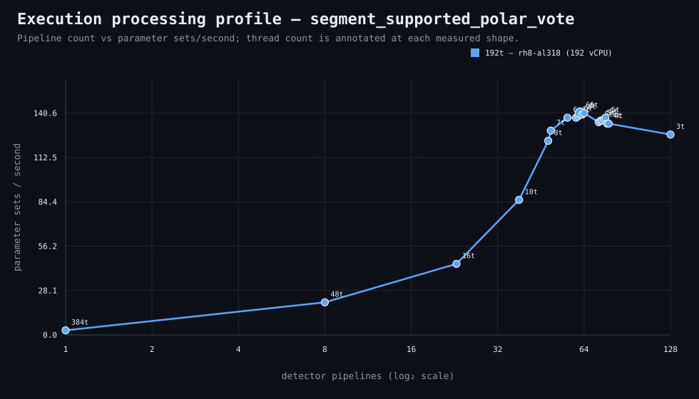

### Execution optimizer summary

Detector: `segment_supported_polar_vote`  
Optimizer run: **31740981857** — execution data below contains only shapes completed in this execution; the preferred configuration may use all compatible completed optimizer evidence.

<strong>Navigation</strong>

- [Preferred Detector Run Configuration](#preferred-detector-run-configuration)
- [Detector Run Profile Plot](#detector-run-profile-plot)
- [Detector Pipeline-Thread Shape Optimization Data](#detector-pipeline-thread-shape-optimization-data)

<strong>1. Preferred Detector Run Configuration</strong>

Compatible completed optimizer runs are coalesced by detector, workload, and concrete runner profile. Repeated shapes retain all observations; the preferred shape is selected canonically by throughput, then lower resource use for throughput-equivalent shapes.

| Detector | Runner | CPU | Physical | Logical | RAM | Preferred pipelines | Threads / pipeline | Preferred shape range (≤2%) | Search method | Optimization time | Allocated | Sets/s | Shape time | Observations |
|---|---|---|---:|---:|---:|---:|---:|---|---|---:|---:|---:|---:|---:|
| segment_supported_polar_vote | 192t — rh8-al318 (192 vCPU) | AMD EPYC 9655 96-Core Processor | 192 | 192 | 1511.3 GiB | 62 | 6 | 61p/6t, 62p/6t, 63p/6t, 64p/6t | adaptive | 2h 36m 48s | 372 | 140.59 | 2m 20s | 1 |

**Search method legend:** `adaptive` = sparse wide-range search with local refinement around the measured peak and ≤2% preferred-shape boundaries; `powers-of-2` = logarithmic power-of-two pipeline sweep; `exhaustive` = every legal pipeline count in the requested range.

**Shape-prediction coverage:** vCPU anchors `192`; readiness **low**; prediction checks **0 verified / 0 pending**.
**Desired / missing optimization data:** missing: a second vCPU size to establish shape scaling.

[↑ Back to Navigation](#table-of-contents)

<strong>2. Detector Run Profile Plot</strong>

Compatible completed measurements are plotted as detector pipelines versus parameter sets/second; thread count is annotated at each measured shape.
**Search method:** `adaptive`

[↑ Back to Navigation](#table-of-contents)

<strong>3. Detector Pipeline-Thread Shape Optimization Data</strong>

Shapes completed in this execution are shown below.

| Runner | Pipelines | Shards | Threads / pipeline | Allocated | Wall | Sets/s | Speedup | Δ from best | Avg load | Peak load | Avg CPU | Peak RAM |
|---|---:|---:|---:|---:|---:|---:|---:|---:|---:|---:|---:|---:|
| 192t — rh8-al318 (192 vCPU) | 48 | 48 | 8 | 384 | 2m 40s | 123.02 | — | -10.62% | 687.5 | 777.6 | 90.1% | 29.8 GiB |
| 192t — rh8-al318 (192 vCPU) | 72 | 72 | 5 | 360 | 2m 26s | 134.82 | — | -2.05% | 838.2 | 1029.3 | 75.3% | 31.9 GiB |
| 192t — rh8-al318 (192 vCPU) | 73 | 73 | 5 | 365 | 2m 25s | 135.74 | — | -1.38% | 886.7 | 925.9 | 76.7% | 32.6 GiB |
| 192t — rh8-al318 (192 vCPU) | 74 | 74 | 5 | 370 | 2m 25s | 135.74 | — | -1.38% | 957.2 | 964.9 | 95.0% | 32.4 GiB |
| 192t — rh8-al318 (192 vCPU) | 75 | 75 | 5 | 375 | 2m 24s | 136.69 | — | -0.69% | 851.4 | 1066.5 | 66.6% | 32.9 GiB |
| **192t — rh8-al318 (192 vCPU)** | 76 | 76 | 5 | 380 | 2m 23s | 137.64 | — | 0.00% | 1038.2 | 1073.4 | 87.1% | 33.3 GiB |
| 192t — rh8-al318 (192 vCPU) | 77 | 77 | 4 | 308 | 2m 27s | 133.90 | — | -2.72% | 861.1 | 1026.2 | 73.5% | 30.8 GiB |
| 192t — rh8-al318 (192 vCPU) | 78 | 78 | 4 | 312 | 2m 27s | 133.90 | — | -2.72% | 978.4 | 993.9 | 82.4% | 30.9 GiB |
| 192t — rh8-al318 (192 vCPU) | 128 | 128 | 3 | 384 | 2m 35s | 126.99 | — | -7.74% | 1000.9 | 1445.5 | 79.2% | 39.5 GiB |

**Early stop:** throughput plateau detected after 3 consecutive completed shapes improved by less than 2.0% from the perceived maximum.

[↑ Back to Navigation](#table-of-contents)
