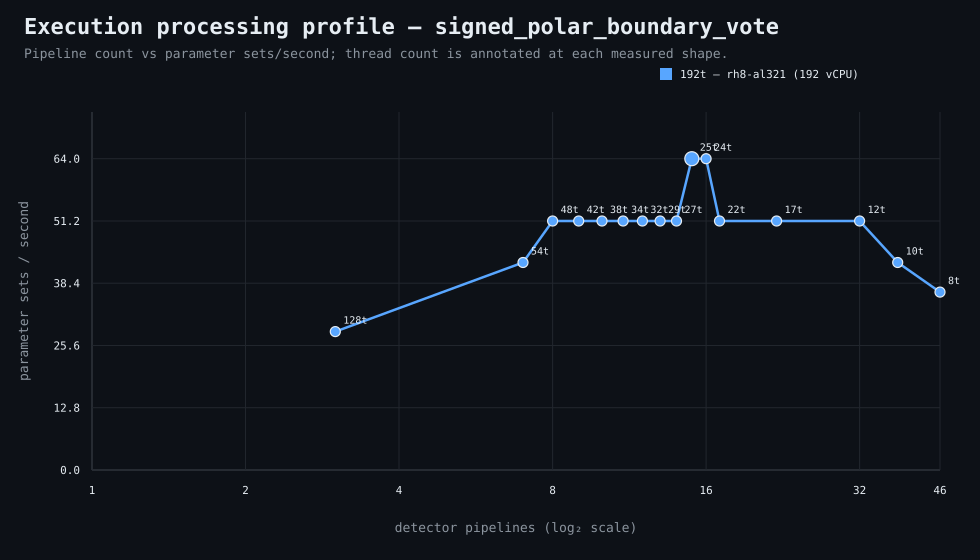

### Execution optimizer summary

Detector: `signed_polar_boundary_vote`  
Optimizer run: **31726329637** — execution data below contains only shapes completed in this execution; the preferred configuration may use all compatible completed optimizer evidence.

<strong>Navigation</strong>

- [Preferred Detector Run Configuration](#preferred-detector-run-configuration)
- [Detector Run Profile Plot](#detector-run-profile-plot)
- [Detector Pipeline-Thread Shape Optimization Data](#detector-pipeline-thread-shape-optimization-data)

<strong>1. Preferred Detector Run Configuration</strong>

Compatible completed optimizer runs are coalesced by detector, workload, and concrete runner profile. Repeated shapes retain all observations; the preferred shape is selected canonically by throughput, then lower resource use for throughput-equivalent shapes.

| Detector | Runner | CPU | Physical | Logical | RAM | Preferred pipelines | Threads / pipeline | Preferred shape range (≤2%) | Search method | Optimization time | Allocated | Sets/s | Shape time | Observations |
|---|---|---|---:|---:|---:|---:|---:|---|---|---:|---:|---:|---:|---:|
| signed_polar_boundary_vote | 192t — rh8-al319 (192 vCPU) | AMD EPYC 9655 96-Core Processor | 192 | 192 | 1511.3 GiB | 40 | 9 | 40p/9t | adaptive | 12m 39s | 360 | 87.48 | 25s | 1 |

**Search method legend:** `adaptive` = sparse wide-range search with local refinement around the measured peak and ≤2% preferred-shape boundaries; `powers-of-2` = logarithmic power-of-two pipeline sweep; `exhaustive` = every legal pipeline count in the requested range.

**Shape-prediction coverage:** vCPU anchors `192`; readiness **low**; prediction checks **0 verified / 0 pending**.
**Desired / missing optimization data:** missing: a second vCPU size to establish shape scaling.

[↑ Back to Navigation](#table-of-contents)

<strong>2. Detector Run Profile Plot</strong>

Compatible completed measurements are plotted as detector pipelines versus parameter sets/second; thread count is annotated at each measured shape.
**Search method:** `adaptive`

[↑ Back to Navigation](#table-of-contents)

<strong>3. Detector Pipeline-Thread Shape Optimization Data</strong>

Shapes completed in this execution are shown below.

| Runner | Pipelines | Shards | Threads / pipeline | Allocated | Wall | Sets/s | Speedup | Δ from best | Avg load | Peak load | Avg CPU | Peak RAM |
|---|---:|---:|---:|---:|---:|---:|---:|---:|---:|---:|---:|---:|
| 192t — rh8-al319 (192 vCPU) | 1 | 1 | 384 | 384 | 8m 3s | 4.53 | 1.00× | -94.82% | 2.8 | 8.3 | 1.5% | 21.1 GiB |
| 192t — rh8-al319 (192 vCPU) | 8 | 8 | 48 | 384 | 1m 13s | 29.96 | 6.62× | -65.75% | 62.8 | 62.8 | 16.7% | 21.4 GiB |
| 192t — rh8-al319 (192 vCPU) | 23 | 23 | 16 | 368 | 37s | 59.11 | 13.05× | -32.43% | 42.6 | 42.6 | 13.1% | 22.7 GiB |
| 192t — rh8-al319 (192 vCPU) | 37 | 37 | 10 | 370 | 29s | 75.41 | 16.66× | -13.79% | 183.2 | 183.2 | 33.6% | 24.2 GiB |
| 192t — rh8-al319 (192 vCPU) | 38 | 38 | 10 | 380 | 27s | 81.00 | 17.89× | -7.41% | — | — | — | — |
| 192t — rh8-al319 (192 vCPU) | 39 | 39 | 9 | 351 | 26s | 84.12 | 18.58× | -3.85% | — | — | — | — |
| **192t — rh8-al319 (192 vCPU)** | 40 | 40 | 9 | 360 | 25s | 87.48 | 19.32× | 0.00% | 297.9 | 297.9 | 38.4% | 24.5 GiB |
| 192t — rh8-al319 (192 vCPU) | 41 | 41 | 9 | 369 | 26s | 84.12 | 18.58× | -3.85% | — | — | — | — |
| 192t — rh8-al319 (192 vCPU) | 64 | 64 | 6 | 384 | 29s | 75.41 | 16.66× | -13.79% | — | — | — | — |

**Stop reason:** `adaptive_search_complete`

[↑ Back to Navigation](#table-of-contents)
